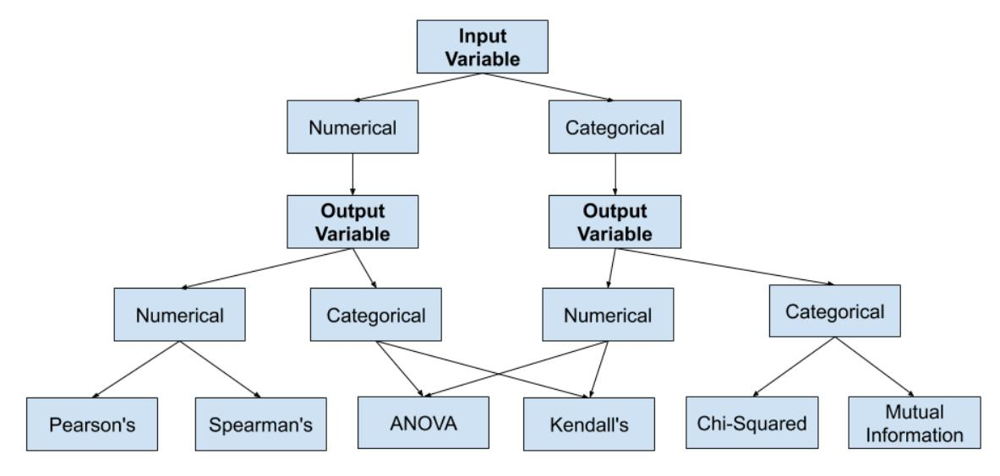
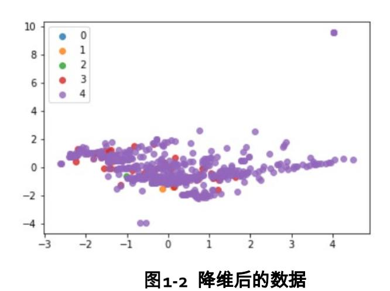

# 《机器学习》– 特征工程实验

# 目录

| 1 特征工程     | 2  |
|------------|----|
|            |    |
| 1.1 实验介绍   |    |
| 1.2 实验目的   | 2  |
| 1.3 实验步骤   |    |
| 1.3.1 特征选择 | 3  |
| 1.3.2 降维   |    |
| 1.4 实验小结   | 12 |
| 1.5 思考题    | 13 |

## **1** 特征工程

## <span id="page-2-1"></span><span id="page-2-0"></span>1.1 实验介绍

本次实验我们将介绍特征选择和降维技术,作为数据挖掘工程中的重要环节,两种技术都可以 提升模型的性能、模型运行效率和数据的可用性。

特征选择和降维都是在数据建模之前,对原始数据特征进行选择或是压缩的重要环节,也是数 据挖掘过程中非常需要处理技巧和消耗时间较多的环节。本章选择最常用的特征选择和降维方 法进行练习,希望进一步加强读者对特征选择和降维方法的理解,帮助读者掌握常规的特征选 择和降维方法。

本次实验数据的特征数量其实是比较少的,但是这里我们为了为大家演示不同特征选择方法的 使用,我们分别使用了 Filter、Wrapper 和 Embedded 三种方法。最后为大家介绍 PCA 的实现 方法。

## <span id="page-2-2"></span>1.2 实验目的

本章包括两大部分实验:

- 1、特征选择,包括特征选择 3 种常见方法 Filter、Wrapper、Embedding 所涉及的经典选择方 法;
- 2、PCA 降维,具体题目如下:

特征选择 - Filter 方法

特征选择 - Wrapper 方法

特征选择 - Embedding 方法

降维 - PCA 原理实现

## <span id="page-3-0"></span>1.3 实验步骤

## <span id="page-3-1"></span>1.3.1 特征选择

特征选择是从特征集中找出与目标变量有影响且具有较高区分性特征去训练模型,获得预测性 能更好的模型。特征选择的主要作用:减少特征数量、降维,使模型泛化能力更强,减少过拟 合;增强对特征和特征值之间的理解。

选择特征首先是考虑特征的发散性和相关性两方面:

特征是否发散:如果一个特征不发散,例如方差接近于 0,也就是说样本在这个特征上基本上 没有差异,这个特征对于样本的区分并没有什么用。

特征与目标的相关性:优先选择与目标相关性高的特征。从特征的方差和相关性考虑。

特征选择方法有很多,主要包含特征减少和特征扩增。这里我们主要介绍特征减少的操作。主 要包括:

单变量特征选择方法:

Filter(过滤法)

基于模型的特征选择方法:

Wrapper(包裹法)

Embedded(嵌入法)

## 1.3.1.1 Filter(过滤法)

Filter 用来衡量每个特征对目标属性的重要性程度,以此来对所有特征/属性进行排序,或者进 行优选操作,特征选择的过程和后续的学习器无关(区别于另外两个方法)。过滤法是一种单 变量统计方法,没有考虑到特征之间的关系特征之间的组合效应难以挖掘,因此很可能选择出 重要但是冗余的特征

常用的具体技术有下述四种:方差选择法、卡方检验、互信息法和相关系数法。

前三种方法通过 sklearn 中的子模块中 feature\_selection 的数据调用:

方差选择法(调用 VarianceThreshold 方法)

卡方检验法(调用 SelectKBest 函数)

互信息法(调用 mutual\_info\_classif 函数)

相关系数法需单独调用 scipy 模块中的 stats.pearsonr()函数直接计算。

过滤法的选择:

方差选择法:可以作为特征选择的预处理,先去掉那些取值变化小的特征,然后再从接下来提 到的的特征选择方法中选择合适的进行进一步的特征选择。



特征选择的方法

#### 步骤 2 数据读取

#### 代码:

raw\_df = pd.read\_csv("AppDataV2.csv",index\_col=0)#读取数据。index\_col=0:读取时不自动添加行号。 raw\_df.head()

#### 输出:

|      | Rating   | Reviews   | Size | Installs   | Туре | Price | Content<br>Rating | Genres | Category_ART_AND_DESIGN | Category_AUTO_AND_VEHICLE | s | 0 |
|------|----------|-----------|------|------------|------|-------|-------------------|--------|-------------------------|---------------------------|---|---|
| 0    | 4.1      | 159       | 19.0 | 10000.0    | 1    | 0.0   | 1                 | 3      | 1                       |                           | 0 |   |
| 1    | 3.9      | 967       | 14.0 | 500000.0   | 1    | 0.0   | 1                 | 3      | 1                       |                           | 0 |   |
| 2    | 4.7      | 87510     | 8.7  | 5000000.0  | 1    | 0.0   | 1                 | 3      | 1                       |                           | 0 |   |
| 3    | 4.5      | 215644    | 25.0 | 50000000.0 | 1    | 0.0   | 4                 | 3      | 1                       |                           | 0 |   |
| 4    | 4.3      | 967       | 2.8  | 100000.0   | 1    | 0.0   | 1                 | 3      | 1                       |                           | 0 |   |
| 5 rc | ows × 41 | 1 columns |      |            |      |       |                   |        |                         |                           |   |   |

#### 代码:

raw\_data = raw\_df.drop(["Rating"], axis=1)#删除指定标签列 labels= raw\_df["Rating"]#标签

#### 步骤 3 无量纲化

#### 无量纲化的常用方法:

标准化:标准化的前提是特征值服从正态分布,标准化后,其转换成标准正态分布。

最大最小归一化:最小值-最大值归一化是将训练集中原始数据中特征的取值缩放到 0 到 1 之 间。这种特征缩放方法实现对原始数据的等比例缩放,比较适用于数值比较集中的情况。

#### 代码:

```
from sklearn.preprocessing import StandardScaler
sc_X=StandardScaler(copy=True)
data = pd.DataFrame(sc_X.fit_transform(raw_data))
data
```

#### 输出:

|   | 0         | 1         | 2         | 3         | 4         | 5         | 6         | 7         | 8         | 9        | <br>30        | 31        | 32        |
|---|-----------|-----------|-----------|-----------|-----------|-----------|-----------|-----------|-----------|----------|---------------|-----------|-----------|
| 0 | -0.260256 | -0.086188 | -0.173110 | -0.282134 | -0.060853 | -0.453022 | -1.610166 | 12.609520 | -0.091489 | -0.07213 | <br>-0.198185 | -0.179025 | -0.203188 |
| 1 | -0.259277 | -0.325793 | -0.164460 | -0.282134 | -0.060853 | -0.453022 | -1.610166 | 12.609520 | -0.091489 | -0.07213 | <br>-0.198185 | -0.179025 | -0.203188 |
| 2 | -0.154461 | -0.579775 | -0.085016 | -0.282134 | -0.060853 | -0.453022 | -1.610166 | 12.609520 | -0.091489 | -0.07213 | <br>-0.198185 | -0.179025 | -0.203188 |
| 3 | 0.000729  | 0.201339  | 0.709424  | -0.282134 | -0.060853 | 2.552773  | -1.610166 | 12.609520 | -0.091489 | -0.07213 | <br>-0.198185 | -0.179025 | -0.203188 |
| 4 | -0.259277 | -0.862509 | -0.171522 | -0.282134 | -0.060853 | -0.453022 | -1.610166 | 12.609520 | -0.091489 | -0.07213 | <br>-0.198185 | -0.179025 | -0.203188 |
| 5 | -0.260246 | -0.728330 | -0.172404 | -0.282134 | -0.060853 | -0.453022 | -1.610166 | 12.609520 | -0.091489 | -0.07213 | <br>-0.198185 | -0.179025 | -0.203188 |
| 6 | -0.260233 | -0.086188 | -0.172404 | -0.282134 | -0.060853 | -0.453022 | -1.610166 | 12.609520 | -0.091489 | -0.07213 | <br>-0.198185 | -0.179025 | -0.203188 |
| 7 | -0.215860 | 0.393023  | -0.155633 | -0.282134 | -0.060853 | -0.453022 | -1.610166 | 12.609520 | -0.091489 | -0.07213 | <br>-0.198185 | -0.179025 | -0.203188 |

请大家分别判断处理的输入变量和输出变量是什么类型的变量(离散数值变量、连续数值变 量、有序分类变量、无序分类变量),并判断我们应该用哪种过滤法?

思路:输出是一个数值数据。Reviews/Size/Installs/Price 是数值数据,用皮尔森关系系数。 Type/Category/Content Rating/Genres 是分类数据,用 ANOVA。

#### 步骤 4 方差选择法

首先我们用方差选择方作为特征选择的预处理

#### 代码:

```
from sklearn.feature_selection import SelectKBest
from sklearn.feature_selection import chi2
from sklearn.feature_selection import VarianceThreshold
#这里我们使用原始数据
```

data\_after\_var = VarianceThreshold(threshold=0.01).fit\_transform(raw\_data,labels) #我们用了很多哑编码,需要 把阈值设置的小些,使用阈值 0.01 进行选择

data\_after\_var.shape

#### 输出:

#### (10240, 31)

#### 代码:

```
data_after_var = pd.concat([pd.DataFrame(data_after_var),labels],axis=1)
data_after_var.to_csv("data_after_var")
```

#### 步骤 5 皮尔森关系系数

对于数值数据我们,首先用皮尔森关系系数做特征选择。皮尔森相关系数是一种最简单的、能 帮助理解特征和标签变量之间关系的方法。它衡量的是变量之间的线性相关性,其值在-1,1 之 间;其中 1 代表变量完全正相关,-1 代表完全负相关。

pearsonr(X,Y):

X:样本数据;

Y:样本标签

返回值:

 第一项是皮尔森相关系数,第二项是 p\_value 值。一般来说皮尔森相关系数越大,p\_value 越小,线性相 关性就越大

#### 代码:

data\_numerical =raw\_data[["Reviews","Size","Installs","Price"]] data\_numerical

#### 输出:

|   | Reviews | Size      | Installs   | Price |
|---|---------|-----------|------------|-------|
| 0 | 159     | 19.000000 | 10000.0    | 0.0   |
| 1 | 967     | 14.000000 | 500000.0   | 0.0   |
| 2 | 87510   | 8.700000  | 5000000.0  | 0.0   |
| 3 | 215644  | 25.000000 | 50000000.0 | 0.0   |
| 4 | 967     | 2.800000  | 100000.0   | 0.0   |
| 5 | 167     | 5.600000  | 50000.0    | 0.0   |
| 6 | 178     | 19.000000 | 50000.0    | 0.0   |

#### 代码:

from sklearn.feature\_selection import SelectKBest from scipy.stats import pearsonr print(pearsonr(data\_numerical["Reviews"],labels)) print(pearsonr(data\_numerical["Size"],labels)) print(pearsonr(data\_numerical["Installs"],labels)) print(pearsonr(data\_numerical["Price"],labels))

#### 输出:

(0.11670456569847402, 2.1845948875648524e-32) (0.057223017556035455, 6.848278283946546e-09) (0.03962971755113228, 6.037723764673582e-05) (-0.022532025751931757, 0.022602245106414908)

根据皮尔森关系系数,比较重要的特征依次为 Reviews、Size、Installs 和 Price。 如果特征比较多的话,用 SelectKBest 保留前 k 个特征(取 top k),方法具体为: sklearn.feature\_selection.SelectKBest(score\_func=<function f\_classif>, k=10),

#### 主要参数如下:

score\_func:选择卡方检验方法,其函数名称为 chi2,并返回一对数组(得分,pvalues)或带有分数的单个数 组。默认值为 f\_classif(适用于分类任务)。

k:默认= 10,表示所选特征数。

#### 主要属性为:

scores\_:array-like,shape =(n\_features,),即该特征在该特征选择方法下的得分;

pvalues\_:array-like,shape =(n\_features,),特征分数的 p 值,如果 score\_func 仅返回分数,则为无。

#### 代码:

data\_numerical = SelectKBest(lambda X,Y:np.array(list(map(lambda x:pearsonr(x,Y),X.T))).T[0],k=3).fit\_transform(data\_numerical,labels) data\_numerical = pd.DataFrame(data\_numerical,columns={"Reviews","Size","Installs"}) data\_numerical.head()

#### 输出:

|   | Size     | Installs | Reviews    |
|---|----------|----------|------------|
| 0 | 159.0    | 19.0     | 10000.0    |
| 1 | 967.0    | 14.0     | 500000.0   |
| 2 | 87510.0  | 8.7      | 5000000.0  |
| 3 | 215644.0 | 25.0     | 50000000.0 |
| 4 | 967.0    | 2.8      | 100000.0   |

Type/Category/Content Rating/Genres 是分类数据,下面我们用 ANOVA 进行特征选择。

在 SelectKBest(score\_func=,k=10) 中参数 score\_func 给出统计指标:

sklearn.feature\_selection.f\_classif:根据方差分析(ANOVA)的原理,以 F-分布为依据,利用平 方和与自由度所计算的祖居与组内均方估计出 F 值,适用于分类问题。

#### 代码:

data\_categorical = pd.concat([raw\_data.iloc[:,4],raw\_data.iloc[:,5:]],axis=1) data\_categorical.head()

#### 输出:

|     | Price   | Content<br>Rating | Genres | Category_ART_AND_DESIGN | Category_AUTO_AND_VEHICLES | Category_BEAUTY | Category_BOOKS_AND_REFERENCE |
|-----|---------|-------------------|--------|-------------------------|----------------------------|-----------------|------------------------------|
| 0   | 0.0     | 1                 | 3      | 1                       | 0                          | 0               | 0                            |
| 1   | 0.0     | 1                 | 3      | 1                       | 0                          | 0               | 0                            |
| 2   | 0.0     | 1                 | 3      | 1                       | 0                          | 0               | 0                            |
| 3   | 0.0     | 4                 | 3      | 1                       | 0                          | 0               | 0                            |
| 4   | 0.0     | 1                 | 3      | 1                       | 0                          | 0               | 0                            |
| 5 r | ows × : | 36 columi         | าร     |                         |                            |                 |                              |

#### 代码:

```
from sklearn.feature_selection import f_classif
data_categorical = pd.DataFrame(SelectKBest(f_classif, k=30).fit_transform(data_categorical, labels))
data_categorical.head()
```

#### 输出:

|     | 0    | 1    | 2    | 3   | 4   | 5   | 6   | 7   | 8   | 9   | <br>20  | 21  | 22  | 23  | 24  | 25  | 26  | 27  | 28  | 29  |
|-----|------|------|------|-----|-----|-----|-----|-----|-----|-----|---------|-----|-----|-----|-----|-----|-----|-----|-----|-----|
| 0   | 0.0  | 1.0  | 3.0  | 1.0 | 0.0 | 0.0 | 0.0 | 0.0 | 0.0 | 0.0 | <br>0.0 | 0.0 | 0.0 | 0.0 | 0.0 | 0.0 | 0.0 | 0.0 | 0.0 | 0.0 |
| 1   | 0.0  | 1.0  | 3.0  | 1.0 | 0.0 | 0.0 | 0.0 | 0.0 | 0.0 | 0.0 | <br>0.0 | 0.0 | 0.0 | 0.0 | 0.0 | 0.0 | 0.0 | 0.0 | 0.0 | 0.0 |
| 2   | 0.0  | 1.0  | 3.0  | 1.0 | 0.0 | 0.0 | 0.0 | 0.0 | 0.0 | 0.0 | <br>0.0 | 0.0 | 0.0 | 0.0 | 0.0 | 0.0 | 0.0 | 0.0 | 0.0 | 0.0 |
| 3   | 0.0  | 4.0  | 3.0  | 1.0 | 0.0 | 0.0 | 0.0 | 0.0 | 0.0 | 0.0 | <br>0.0 | 0.0 | 0.0 | 0.0 | 0.0 | 0.0 | 0.0 | 0.0 | 0.0 | 0.0 |
| 4   | 0.0  | 1.0  | 3.0  | 1.0 | 0.0 | 0.0 | 0.0 | 0.0 | 0.0 | 0.0 | <br>0.0 | 0.0 | 0.0 | 0.0 | 0.0 | 0.0 | 0.0 | 0.0 | 0.0 | 0.0 |
| 5 r | ows: | × 30 | colu | mns |     |     |     |     |     |     |         |     |     |     |     |     |     |     |     |     |

#### 最后将数值和分类数据拼接在一起。

#### 代码:

```
df_after_filter = pd.concat([data_numerical,data_categorical],axis=1)
df_after_filter.head()
df_after_filter = pd.concat([df_after_filter,labels],axis=1)
df_after_filter.to_csv("df_after_filter.csv")
```

#### 输出:

|     | Size       | Installs | Reviews    | 0   | 1   | 2   | 3   | 4   | 5   | 6   | <br>20  | 21  | 22  | 23  | 24  | 25  | 26  | 27  | 28  | 29  |
|-----|------------|----------|------------|-----|-----|-----|-----|-----|-----|-----|---------|-----|-----|-----|-----|-----|-----|-----|-----|-----|
| 0   | 159.0      | 19.0     | 10000.0    | 0.0 | 1.0 | 3.0 | 1.0 | 0.0 | 0.0 | 0.0 | <br>0.0 | 0.0 | 0.0 | 0.0 | 0.0 | 0.0 | 0.0 | 0.0 | 0.0 | 0.0 |
| 1   | 967.0      | 14.0     | 500000.0   | 0.0 | 1.0 | 3.0 | 1.0 | 0.0 | 0.0 | 0.0 | <br>0.0 | 0.0 | 0.0 | 0.0 | 0.0 | 0.0 | 0.0 | 0.0 | 0.0 | 0.0 |
| 2   | 87510.0    | 8.7      | 5000000.0  | 0.0 | 1.0 | 3.0 | 1.0 | 0.0 | 0.0 | 0.0 | <br>0.0 | 0.0 | 0.0 | 0.0 | 0.0 | 0.0 | 0.0 | 0.0 | 0.0 | 0.0 |
| 3   | 215644.0   | 25.0     | 50000000.0 | 0.0 | 4.0 | 3.0 | 1.0 | 0.0 | 0.0 | 0.0 | <br>0.0 | 0.0 | 0.0 | 0.0 | 0.0 | 0.0 | 0.0 | 0.0 | 0.0 | 0.0 |
| 4   | 967.0      | 2.8      | 100000.0   | 0.0 | 1.0 | 3.0 | 1.0 | 0.0 | 0.0 | 0.0 | <br>0.0 | 0.0 | 0.0 | 0.0 | 0.0 | 0.0 | 0.0 | 0.0 | 0.0 | 0.0 |
| 5 r | ows × 33 c | columns  |            |     |     |     |     |     |     |     |         |     |     |     |     |     |     |     |     |     |

## 1.3.1.2 Wrapper(包裹法)

Wrapper,包裹法,也形象地称为"弯刀法",它解决思路没有过滤法直接,它是在确认后续的 算法模型后,把模型本身的性能作为评价准则:选择一个目标函数来一步步的筛选特征。常用 包装法是递归特征消除法,简称 RFE,使用一个基模型来进行多轮训练,每轮训练后,移除若 干权值系数的特征,再基于新的特征集进行下一轮训练。

在 sklearn 中,我们这里一起学习递归消除特征法,使用一个基模型来进行多轮训练,每轮训 练后,消除若干权值系数的特征,再基于新的特征集进行下一轮训练。使用 feature\_selection 库的 RFE 类来选择特征。 sklearn.feature\_selection.RFE(estimator, step=1)

estimator:该参数传入用于递归构建模型的有监督型基学习器,要求该基学习器具有 fit 方法,且其输出含有

coef\_或 feature\_importances\_这种结果;

step:数值型,默认为 1,控制每次迭代过程中删去的特征个数。

#### 函数返回值:

n\_features\_:通过交叉验证过程最终剩下的特征个数;

support\_:被选择的特征的被选择情况(True 表示被选择,False 表示被淘汰);

ranking\_:所有特征的评分排名;

estimator\_:利用剩下的特征训练出的模型

#### 代码:

from sklearn.feature\_selection import RFE from sklearn.linear\_model import Lasso

#递归特征消除法,返回特征选择后的数据

#参数 estimator 为基模型

#参数 n\_features\_to\_select 为选择的特征个数

wrapper\_selection = RFE(estimator=Lasso(), n\_features\_to\_select=30)

df\_after\_wrapper = pd.DataFrame(wrapper\_selection.fit\_transform(raw\_data,labels))

df\_after\_wrapper.head()

#### 输出:

|     | 0          | 1    | 2          | 3   | 4   | 5   | 6   | 7   | 8   | 9   | <br>20  | 21  | 22  | 23  | 24  | 25  | 26  | 27  | 28  | 29  |
|-----|------------|------|------------|-----|-----|-----|-----|-----|-----|-----|---------|-----|-----|-----|-----|-----|-----|-----|-----|-----|
| 0   | 159.0      | 19.0 | 10000.0    | 1.0 | 0.0 | 1.0 | 3.0 | 1.0 | 0.0 | 0.0 | <br>0.0 | 0.0 | 0.0 | 0.0 | 0.0 | 0.0 | 0.0 | 0.0 | 0.0 | 0.0 |
| 1   | 967.0      | 14.0 | 500000.0   | 1.0 | 0.0 | 1.0 | 3.0 | 1.0 | 0.0 | 0.0 | <br>0.0 | 0.0 | 0.0 | 0.0 | 0.0 | 0.0 | 0.0 | 0.0 | 0.0 | 0.0 |
| 2   | 87510.0    | 8.7  | 5000000.0  | 1.0 | 0.0 | 1.0 | 3.0 | 1.0 | 0.0 | 0.0 | <br>0.0 | 0.0 | 0.0 | 0.0 | 0.0 | 0.0 | 0.0 | 0.0 | 0.0 | 0.0 |
| 3   | 215644.0   | 25.0 | 50000000.0 | 1.0 | 0.0 | 4.0 | 3.0 | 1.0 | 0.0 | 0.0 | <br>0.0 | 0.0 | 0.0 | 0.0 | 0.0 | 0.0 | 0.0 | 0.0 | 0.0 | 0.0 |
| 4   | 967.0      | 2.8  | 100000.0   | 1.0 | 0.0 | 1.0 | 3.0 | 1.0 | 0.0 | 0.0 | <br>0.0 | 0.0 | 0.0 | 0.0 | 0.0 | 0.0 | 0.0 | 0.0 | 0.0 | 0.0 |
| 5 r | ows × 30 c | olum | ns         |     |     |     |     |     |     |     |         |     |     |     |     |     |     |     |     |     |

#### 代码:

wrapper\_selection.ranking\_

#### 输出:

```
array([ 1, 1, 1, 1, 1, 1, 1, 1, 1, 1, 1, 1, 1, 1, 1, 3, 5,
 7, 9, 11, 10, 8, 6, 4, 2, 1, 1, 1, 1, 1, 1, 1, 1, 1,
 1, 1, 1, 1, 1, 1])
```

#### 代码:

df\_after\_wrapper.to\_csv("df\_after\_wrapper.csv")

### 1.3.1.3 Embedded (嵌入法)[¶](http://localhost:8888/notebooks/%E5%BC%80%E5%8F%91%20-%20EBG%E5%9C%A8%E7%BA%BF%E6%9C%BA%E5%99%A8%E5%AD%A6%E4%B9%A0%E5%AE%9E%E8%B7%B5/4.%20%E7%89%B9%E5%BE%81%E9%80%89%E6%8B%A9%E4%B8%8E%E9%99%8D%E7%BB%B4.ipynb#1.4-Embedded-(%E5%B5%8C%E5%85%A5%E6%B3%95))

Embedded,即嵌入法,相比前两种方法更加复杂,它利用机器学习算法和模型进行训练,得 到各个特征的权值系数,根据权值系数从大到小来选择特征。常用嵌入法技术主要有两类方 法:线性模型和正则化,其中包括具体的练习有 2 个:基于线性回归模型方法、基于 L1 的正 则化方法;另一类是基于树模型的特征选择,这里仅练习基于随机森林的嵌入方法,随机森林 具有准确率高、稳定性强、易于使用等优点,是目前最流行的机器学习算法之一,基于随机森 林的预测模型能够用来计算特征的重要程度,因此能用来去除不相关的特征。

在 sklearn 中,我们选择使用 SelectFromModel 来进行嵌入法的特征选择。SelectFromModel 主 要包括:L1-based feature selection (基于 L1 的特征选取)、Tree-based feature selection (基于 Tree(树)的特征选取) 等。这里我们主要来学习基于 L1 的特征选取。

class sklearn.feature\_selection.SelectFromModel(estimator, threshold=None,prefit=False):

 estimator:构建特征选择实例的基本分类器。稀疏估计量对于回归中的 linear\_model.Lasso、分类中的 linear\_model.LogisticRegression 和 svm.LinearSVC 都很有用。

 threshold:默认为 None。该参数指定特征选择的阈值,词语在分类模型中对应的系数值大于该值时被保 留,否则被移除。可设置的值有"mean"表示系数向量值的均值,"median"表示系数向量值的中值。当该参数设 置值为 None 时,如果分类器具有罚项且罚项设置为 l1,则阈值为 1e-5,否则该值为"mean"。

 prefit:布尔类型。默认值为 False。是否对传入的基本分类器事先进行训练。如果设置该值为 True,则需 要对传入的基本分类器进行训练,如果设置该值为 False,则只需要传入分类器实例即可

#### 代码:

from sklearn.feature\_selection import SelectFromModel

from sklearn.linear\_model import Lasso# 以 L1 正则化的线性模型 Lasso 为例

#带 L1 惩罚项的逻辑回归作为基模型的特征选择。对于 Lasso,参数 alpha 越大,被选中的特征越少

lasso = Lasso(alpha=0.001)

lasso.fit(data,labels)

model = SelectFromModel(lasso, prefit=True)

df\_after\_embedded = model.transform(raw\_data)

df\_after\_embedded = pd.DataFrame(df\_after\_embedded)

df\_after\_embedded.head()

df\_after\_embedded.to\_csv("df\_after\_embedded.csv")

#### 输出:

|     | 0          | 1     | 2          | 3   | 4   | 5   | 6   | 7   | 8   | 9   | <br>27  | 28  | 29  | 30  | 31  | 32  | 33  | 34  | 35  | 36  |
|-----|------------|-------|------------|-----|-----|-----|-----|-----|-----|-----|---------|-----|-----|-----|-----|-----|-----|-----|-----|-----|
| 0   | 159.0      | 19.0  | 10000.0    | 1.0 | 0.0 | 1.0 | 3.0 | 1.0 | 0.0 | 0.0 | <br>0.0 | 0.0 | 0.0 | 0.0 | 0.0 | 0.0 | 0.0 | 0.0 | 0.0 | 0.0 |
| 1   | 967.0      | 14.0  | 500000.0   | 1.0 | 0.0 | 1.0 | 3.0 | 1.0 | 0.0 | 0.0 | <br>0.0 | 0.0 | 0.0 | 0.0 | 0.0 | 0.0 | 0.0 | 0.0 | 0.0 | 0.0 |
| 2   | 87510.0    | 8.7   | 5000000.0  | 1.0 | 0.0 | 1.0 | 3.0 | 1.0 | 0.0 | 0.0 | <br>0.0 | 0.0 | 0.0 | 0.0 | 0.0 | 0.0 | 0.0 | 0.0 | 0.0 | 0.0 |
| 3   | 215644.0   | 25.0  | 50000000.0 | 1.0 | 0.0 | 4.0 | 3.0 | 1.0 | 0.0 | 0.0 | <br>0.0 | 0.0 | 0.0 | 0.0 | 0.0 | 0.0 | 0.0 | 0.0 | 0.0 | 0.0 |
| 4   | 967.0      | 2.8   | 100000.0   | 1.0 | 0.0 | 1.0 | 3.0 | 1.0 | 0.0 | 0.0 | <br>0.0 | 0.0 | 0.0 | 0.0 | 0.0 | 0.0 | 0.0 | 0.0 | 0.0 | 0.0 |
| 5 r | ows × 37 c | colum | ns         |     |     |     |     |     |     |     |         |     |     |     |     |     |     |     |     |     |

以上为大家演示了 Filter、Wrapper 和 Embedded 三种特征选择的方法。

## <span id="page-11-0"></span>1.3.2 降维

PCA 的思想是将 n 维特征映射到 k 维上(k<n),这 k 维是全新的正交特征。这 k 维特征称为主 成分,是重新构造出来的 k 维特征,而不是简单地从 n 维特征中去除其余 n-k 维特征(这也是 与特征选择特征子集的方法的区别)。 在 sklearn 中,实现 PCA 降维的方法为:

sklearn.decomposition.PCA(n\_components=None, copy=True, svd\_solver='auto')

n\_components:PCA 降维后的特征维度数目,或者是主成分的方差和所占的最小比例阈值。

copy:表示是否将原始数据复制一份。默认为 True,则运行 PCA 算法后,原始数据的值不会有任何改变。

svd\_solver:指定奇异值分解 SVD 的方法。有 4 个可以选择的值:{'auto', 'full', 'arpack', 'randomized'}。

 'randomized' 一般适用于数据量大,数据维度多同时主成分数目比例又较低的 PCA 降维,它使用了一些 加快 SVD 的随机算法。

'full' 则是传统意义上的 SVD,使用了 scipy 库对应的实现。

 'arpack' 和 randomized 的适用场景类似,区别是 randomized 使用的是 scikit-learn 自己的 SVD 实现,而 arpack 直接使用了 scipy 库的 sparse SVD 实现。当 svd\_solve 设置为'arpack'时,保留的成分必须少于特征数, 即不能保留所有成分。

 默认是'auto',即 PCA 类会自己去在前面讲到的三种算法里面去权衡,选择一个合适的 SVD 算法来降 维。一般来说,使用默认值就够了。

#### 步骤 1 PCA 实现

#### 代码:

from sklearn.decomposition import PCA pca = PCA(n\_components=0.85) data\_after\_pca=pd.DataFrame(pca.fit\_transform(data)) data\_after\_pca

#### 输出

|   | 0        | 1         | 2        | 3         | 4         | 5         | 6         | 7        | 8        | 9        |  |
|---|----------|-----------|----------|-----------|-----------|-----------|-----------|----------|----------|----------|--|
| 0 | 1.013810 | -2.094003 | 1.781861 | -0.710991 | -0.309563 | -0.154063 | -0.606461 | 0.070218 | 0.050749 | 0.117744 |  |
| 1 | 0.927168 | -2.127113 | 1.860392 | -0.769243 | -0.246228 | -0.119950 | -0.610342 | 0.074617 | 0.048667 | 0.115537 |  |
| 2 | 0.871587 | -2.078332 | 1.999967 | -0.808373 | -0.168881 | -0.062339 | -0.609545 | 0.079099 | 0.043698 | 0.114624 |  |
| 3 | 2.279558 | -1.038796 | 1.048401 | -1.479500 | 0.609976  | 0.157311  | -0.535096 | 0.077318 | 0.122395 | 0.137141 |  |
| 4 | 0.728640 | -2.214673 | 2.025841 | -0.902984 | -0.106546 | -0.048674 | -0.620346 | 0.085079 | 0.042561 | 0.110447 |  |

经过 PCA 降维后,我们将 91 维的特征转换为 42 维的特征,同时保存了 85%的信息量。

#### 步骤 2 可视化

代码:

```
scaled_labels = pd.DataFrame(labels.astype("int"),columns={"Rating"})
data_after_pca_withlabels = pd.concat([data_after_pca,labels],axis=1)
data_after_pca_withlabels.head()
data_after_pca_withlabels.to_csv("after_pca.csv")
```

#### 输出:

|     | 0          | 1         | 2        | 3         | 4         | 5         | 6         | 7        | 8        | 9        |  |
|-----|------------|-----------|----------|-----------|-----------|-----------|-----------|----------|----------|----------|--|
| 0   | 1.013810   | -2.094003 | 1.781861 | -0.710991 | -0.309563 | -0.154063 | -0.606461 | 0.070218 | 0.050749 | 0.117744 |  |
| 1   | 0.927168   | -2.127113 | 1.860392 | -0.769243 | -0.246228 | -0.119950 | -0.610342 | 0.074617 | 0.048667 | 0.115537 |  |
| 2   | 0.871587   | -2.078332 | 1.999967 | -0.808373 | -0.168881 | -0.062339 | -0.609545 | 0.079099 | 0.043698 | 0.114624 |  |
| 3   | 2.279558   | -1.038796 | 1.048401 | -1.479500 | 0.609976  | 0.157311  | -0.535096 | 0.077318 | 0.122395 | 0.137141 |  |
| 4   | 0.728640   | -2.214673 | 2.025841 | -0.902984 | -0.106546 | -0.048674 | -0.620346 | 0.085079 | 0.042561 | 0.110447 |  |
| 5 r | ows × 32 c | columns   |          |           |           |           |           |          |          |          |  |

#### 代码:

```
import matplotlib.pyplot as plt
def draw_graph(X):
 for i in range(5):
 plt.scatter(data_after_pca_withlabels.loc[data_after_pca_withlabels.Rating==i,0],
 data_after_pca_withlabels.loc[data_after_pca_withlabels.Rating==i,1], alpha=0.8, 
label='%s' % i)
 plt.legend()
 plt.show()
draw_graph(data)
```

#### 输出:



## <span id="page-12-0"></span>1.4 实验小结

本实验主要讲解特征工程与数据降维的实现,包括 Filter、Wrapper 和 Embedded 三种特征选 择方法和 PCA 降维的实现。

## <span id="page-13-0"></span>1.5 思考题

鸢尾花数据集是数据挖掘练习中最常使用的学习数据集,分别有 4 个特征表征花的不同特点, 目标变量 target 是 3 种不同的鸢尾花类型。4 个特征分别是:sepal length (cm)(花萼长度)、 sepal width (cm)(花萼宽度)、petal length (cm)(花瓣长度)、petal width(cm)(花瓣宽 度)。目标变量 target 是三种鸢尾花:setosa(山鸢尾)、versicolor(杂色鸢尾)、virginica (维吉尼亚鸢尾)。

利用开源的鸢尾花数据集分别完成 Filter 方法中的方差选择法、卡方检验方法、相关系数法、 互信息法 4 个具体方法的编程实现。