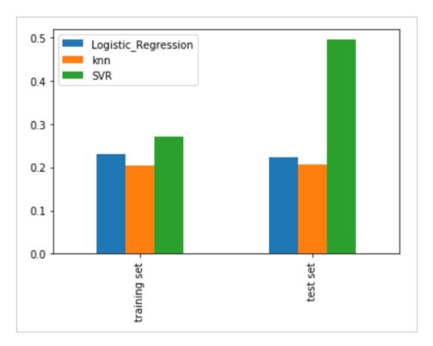
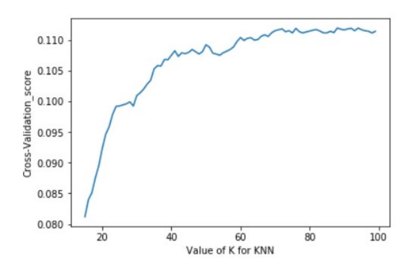

## 《机器学习》 – 监督学习

## 目录

| 1 🕏        | <b>C验介绍</b>  | . 3  |
|------------|--------------|------|
| 2 <b>A</b> | PP 评分预测      | . 3  |
| 2.1        | 实验介绍         | 3    |
| 2.1.1      | . 简介         | 3    |
| 2.1.2      | .实验目的        | 3    |
| 2.2        | 实验环境要求       | 3    |
| 2.3        | 实验总体设计       | . 4  |
| 2.4        | 实验步骤         | . 4  |
| 2.4.2      | 」数据读取        | . 4  |
| 2.4.2      | 。线性回归        | 5    |
|            | 3 KNN 回归     |      |
| 2.4.       | ,模型评估与选择     | . 8  |
| 2.5        | 实验小结         | .10  |
| 3 粉        | <b>書尿病预测</b> | 11   |
| 3.1        | 实验说明         | . 11 |
| 3.2        | 实验建模流程要求     | 11   |
| 3.2.1      | 环境要求         | . 11 |
| 3.2.2      | 。实验实现步骤要求    | . 11 |

# **1** 实验介绍

<span id="page-2-0"></span>机器学习分为监督学习、无监督学习、半监督学习、强化学习。监督学习是指利用一组已知类 别的样本调整分类器的参数,使其达到所要求性能的过程,也称为监督训练或有教师学习。分 类和回归是监督学习中的两种典型任务。

<span id="page-2-1"></span>本章实验涉及线性回归、KNN 回归等回归算法,以及逻辑回归等分类算法,通过不同算法的 效果对比来加深对算法的理解。

# **2 APP** 评分预测

## <span id="page-2-2"></span>2.1 实验介绍

## <span id="page-2-3"></span>2.1.1 简介

 本次实验利用数据预处理与特征工程中处理好的数据集来训练一个回归和分类模型,对评 分的预测。

利用线性回归、KNN 回归算法,训练两个回归模型。

## <span id="page-2-4"></span>2.1.2 实验目的

掌握线性回归算法的应用实践

掌握 KNN 算法的应用实践

## <span id="page-2-5"></span>2.2 实验环境要求

本地 PC,Python3

## <span id="page-3-0"></span>2.3 实验总体设计


## <span id="page-3-1"></span>2.4 实验步骤

### <span id="page-3-2"></span>2.4.1 数据读取

#### 代码:

```
#导入相关库
import pandas as pd
import matplotlib.pyplot as plt
import seaborn as sns
import numpy as np
#读取数据集
data_after_pca = pd.read_csv('after_pca.csv',index_col=0)
data = pd.read_csv('AppDataV2.csv',index_col=0)
data_after_var = pd.read_csv("data_after_var",index_col=0)
data_after_filter = pd.read_csv("df_after_filter.csv",index_col=0)
#首先确定样本的数据的标签
X = data.drop(["Rating"],axis='columns')
Y = data["Rating"]
X_var = data_after_var.drop(["Rating"],axis='columns')
Y_var = data_after_var["Rating"]
X_pca = data_after_pca.drop(["Rating"],axis='columns')
Y_pca = data_after_pca["Rating"]
X_filter = data_after_filter.drop(["Rating"],axis='columns')
Y_filter = data_after_filter["Rating"]
X.info()
输出:
<class 'pandas.core.frame.DataFrame'>
Int64Index: 10240 entries, 0 to 10239
```

Data columns (total 40 columns):

Reviews 10240 non-null int64 Size 10240 non-null float64 Installs 10240 non-null float64 Type 10240 non-null int64 Price 10240 non-null float64 Content Rating 10240 non-null int64 Genres 10240 non-null int64

Category\_ART\_AND\_DESIGN 10240 non-null int64 Category\_AUTO\_AND\_VEHICLES 10240 non-null int64 Category\_BEAUTY 10240 non-null int64

Category\_BOOKS\_AND\_REFERENCE 10240 non-null int64

…

#### 代码:

#### #数据集划分

from sklearn.model\_selection import train\_test\_split

X\_train, X\_test, y\_train, y\_test = train\_test\_split(X, Y, test\_size = 0.2, random\_state = 10)

### <span id="page-4-0"></span>2.4.2 线性回归

sklearn.linear\_model.LinearRegression(fit\_intercept=True, normalize=False, copy\_X=True)

#### 参数说明:

fit\_intercept:默认 True,是否计算模型的截距,为 False 时,则数据中心化处理。

normalize:默认 False,是否中心化,或者使用 sklearn.preprocessing.StandardScaler()。

copy\_X:默认 True,否则 X 会被改写。

#### 代码:

from sklearn.linear\_model import LinearRegression

from sklearn.neighbors import KNeighborsRegressor

from sklearn.metrics import

mean\_squared\_error,mean\_absolute\_error,accuracy\_score,accuracy\_score,r2\_score

#### #初始化线性回归模型

linreg = LinearRegression()

#训练模型

linreg.fit(X\_train,y\_train)

#训练集上的 MSE

linreg\_pred\_train = linreg.predict(X\_train)

linreg\_mse\_train = mean\_squared\_error(linreg\_pred\_train,y\_train)

#输出测试集上的测试结果

linreg\_pred\_test=linreg.predict(X\_test)

linreg\_mse\_test = mean\_squared\_error(linreg\_pred\_test,y\_test)

print("训练集 MSE:", linreg\_mse\_train) print("测试集 MSE:", linreg\_mse\_test)

输出:

训练集 MSE: 0.2308388846541144 测试集 MSE: 0.22350603712434897

## <span id="page-5-0"></span>2.4.3 KNN 回归

sklearn.neighbors.KNeighborsRegressor(n\_neighbors=5, weights='uniform', algorithm='auto', leaf\_size=30):

#### 参数说明:

n\_neighbors:knn 算法中指定以最近的几个最近邻样本具有投票权,默认参数为 5

algrithm:即内部采用什么算法实现。有以下几种选择参数:

'ball\_tree':球树、

'kd\_tree':kd 树、

'brute':暴力搜索、

'auto':自动根据数据的类型和结构选择合适的算法。默认情况下是'auto'。

 暴力搜索就不用说了大家都知道。具体前两种树型数据结构哪种好视情况而定。KD 树是 对依次对 K 维坐标轴,以中值切分构造的树,每一个节点是一个超矩形,在维数小于 20 时效率 最高 ball tree 是为了克服 KD 树高维失效而发明的,其构造过程是以质心 C 和半径 r 分割样本 空间,每一个节点是一个超球体。一般低维数据用 kd\_tree 速度快,用 ball\_tree 相对较慢。超 过 20 维之后的高维数据用 kd\_tree 效果反而不佳,而 ball\_tree 效果要好,具体构造过程及优 劣势的理论大家有兴趣可以去具体学习。

 leaf\_size:这个值控制了使用 KD 树或者球树时, 停止建子树的叶子节点数量的阈值。这个 值越小,则生成的 KD 树或者球树就越大,层数越深,建树时间越长,反之,则生成的 KD 树 或者球树会小,层数较浅,建树时间较短。默认是 30.

请根据线性回归的实现和 KNN 的参数说明,训练一个 KNN 模型。代码填写:

#### #初始化 knn 模型

knn\_model = KNeighborsRegressor(n\_neighbors=50)

#训练

knn\_model.fit(X\_train,y\_train)

#### #训练集上的 MSE

knn\_pred\_train = knn\_model.predict(X\_train)

knn\_mse\_train = mean\_squared\_error(knn\_pred\_train,y\_train)

#输出测试集上的测试结果

knn\_pred\_test=knn\_model.predict(X\_test)

knn\_mse\_test = mean\_squared\_error(knn\_pred\_test,y\_test)

print("训练集 MSE:", knn\_mse\_train) print("测试集 MSE:", knn\_mse\_test)

#### 输出:

训练集 MSE: 0.2044843076171875 测试集 MSE: 0.20693282421875

接下来简单对三个模型的输出精度进行对比。

#### 代码:

model\_mse = pd.DataFrame(data=[[linreg\_mse\_train,knn\_mse\_train,svr\_mse\_train], [linreg\_mse\_test,knn\_mse\_test,svr\_mse\_test]],

columns=['Logistic\_Regression','knn','SVR'],index=["training set","test set"])

model\_mse

#### 输出:

|              | Logistic_Regression | knn      | SVR      |
|--------------|---------------------|----------|----------|
| training set | 0.230839            | 0.204484 | 0.270277 |
| test set     | 0.223506            | 0.206933 | 0.494534 |

#### 代码:

plt.figure(figsize=(20, 10))

model\_mse.plot(kind = 'bar')

#### 输出:



**LR**、**KNN**、**SVR** 算法对比

## <span id="page-7-0"></span>2.4.4 模型评估与选择

通过上面的对比,可以看出 4 个模型都欠拟合的状态。接下来将使用交叉验证、网格搜索和随 机搜索的方式,选择模型的超参数。

#### 实验目的:

- (1)掌握交叉验证算法的应用实践
- (2)掌握网络搜索的实现
- (3)掌握随机搜索的实现

#### 2.4.4.1 交叉验证

将用交叉验证来搜索 KNN 的模型中 n\_neighbors 的最佳参数值。

#### 代码:

from sklearn.model\_selection import cross\_val\_score # K 折交叉验证模块

#### #建立测试参数集

k\_range = range(15, 100)

k\_scores = []

#藉由迭代的方式来计算不同参数对模型的影响,并返回交叉验证后的平均准确率 for k in k\_range:

knn = KNeighborsRegressor(n\_neighbors=k)

scores = cross\_val\_score(knn, X\_train, y\_train, cv=10)

```
 k_scores.append(scores.mean())
#可视化数据
plt.plot(k_range, k_scores)
plt.xlabel('Value of K for KNN')
plt.ylabel('Cross-Validation_score')
```

#### 输出:

plt.show()



不同 **K** 值对模型的影响

根据上图结果,可知 n\_neighbors 的数值在 62 左右最佳,大于此值后模型的表现没有明显提 升。

#### 2.4.4.2 参数搜索

本小节分别用将用网格搜索和随机搜索的方式,对决策树分类器和 SVM 回归模型的超参数进 行搜索。

#### 代码:

#### ###决策树分类器

from sklearn.model\_selection import GridSearchCV

#### params =

[{'criterion':['gini'],'max\_depth':[30,50,60,100],'min\_samples\_leaf':[2,3,5,10],'min\_impurity\_decrease':[0.1,0.2, 0.5]},

{'criterion':['gini','entropy']},

{'max\_depth': [30,60,100], 'min\_impurity\_decrease':[0.1,0.2,0.5]}]

best\_model = GridSearchCV(dtree, param\_grid=params,cv = 5,scoring ="accuracy")

best\_model.fit(X\_train,y\_train\_int)

print('最优分类器:',best\_model.best\_params\_,'最优分数:', best\_model.best\_score\_) # 得到最优的参数和分 值

#### 输出:

最优分类器: {'criterion': 'gini', 'max\_depth': 30, 'min\_impurity\_decrease': 0.1, 'min\_samples\_leaf': 2} 最优分 数: 0.781982421875

接下来用随机搜索搜索 SVM 回归模型的参数。

#### 代码:

from sklearn.model\_selection import RandomizedSearchCV

params\_svr = {'kernel': ['rbf'], 'C': np.logspace(-3, 2, 6), 'gamma':np.arange(0,10,2)}

best\_svr\_model = RandomizedSearchCV(svr, param\_distributions=params\_svr,cv = 3,scoring ="neg\_mean\_squared\_error")

best\_svr\_model.fit(X,Y)

print('最优分类器:',best\_svr\_model.best\_params\_,'最优分数:', best\_svr\_model.best\_score\_) # 得到最优的 参数和分值

#### 输出:

最优分类器: {'kernel': 'rbf', 'gamma': 4, 'C': 1.0} 最优分数: -0.24169698734960568

## <span id="page-9-0"></span>2.5 实验小结

本章通过代码实践,帮助学习者了解了机器学习算法实践应用的流程,并使用处理过的 APP 评分数据进行回归建模,最后通过交叉验证、网络搜素和随机搜索等算法对模型进行超参数寻 优。

# **3** 糖尿病预测

## <span id="page-10-1"></span><span id="page-10-0"></span>3.1 实验说明

该数据集(pima-indians-diabetes.data)是来自美国疾病控制预防中心的数据,背景是记录美国的 糖尿病症状信息,现在美国 1/7 的成年人患有糖尿病。但是到 2050 年,这个比例将会快速增 长至高达 1/3。可以利用从 UCI 机器学习数据库里一个关于印第安人糖尿病数据集,通过数据 挖掘相关算法来预测糖尿病,该问题本质上是一个二元分类问题。

## <span id="page-10-2"></span>3.2 实验建模流程要求

基于 Diabete 数据,使用逻辑回归进行糖尿病预测。

### <span id="page-10-3"></span>3.2.1 环境要求

Python 3.7

## <span id="page-10-4"></span>3.2.2 实验实现步骤要求

## 3.2.2.1 相关模块导入

步骤 1 要求导入相关数据读取、处理、分析、可视化,算法模块等

## 3.2.2.2 数据导入与初步探索

步骤 1 要求载入本地数据集(pima-indians-diabetes.data),以 dataframe 形式存放后,命名为 df

步骤 2 查看数据尺寸、打印信息,判断特征的类型(名称性、数值型),目标变量分布以及 查看是否均衡

步骤 3 对 df 特征进行相关性可视化

步骤 4 对 df 每个特征的分布进行可视化查看

步骤 5 对输入特征进行降维,选择 PCA,并按提示补充如下代码中划线部分内容。

### 对输入特征进行降维处理 from sklearn.decomposition import PCA from sklearn import preprocessing #调用标准化模块 #降维训练前需要对数据标准化 pca = PCA( ) # 保留 99%信息的主成分个主成分 X\_pca =pca.fit(X\_std).transform(X\_std) ##输出 the Top 95% variance\_ratio ##输出 X\_pca.shape

步骤 6 结合相关性分析和降维后的结论,选择数据进行拆分为训练集和测试集,拆分比例设 置为 0.1,指定以 Target 的比例做分层抽样。部分提示如下:

from collections import Counter

from sklearn.model\_selection import train\_test\_split

步骤 7 选择逻辑回归算法对拆分后的数据进行建模训练和预测,其中要求将原始模型做 5 折 交叉验证,评估指标选择 f1。

#### 部分提示如下:

#### #引入逻辑回归和交叉验证的库

from sklearn.linear\_model import LogisticRegression

from sklearn.model\_selection import cross\_val\_score

#### #引入评价指标的库

from sklearn.metrics import f1\_score

#### 步骤 8 对逻辑回归的几个重要参数进行网格搜索,网格设置参考如下:

c\_range=[0.001,0.01,0.1,1.0] solvers = ['liblinear','lbfgs','newton-cg','sag'] max\_iters=[80,100,150,200,300] tuned\_parameters= dict(solver=solvers, C=c\_range,max\_iter=max\_iters)

步骤 9 根据搜索参数,最后确认模型,进行预测。