# **Machine Learning & Pattern Recognition**

# **Bayes Classifiers**

## **Classifiers and Discriminant Functions**

Classifiers can be represented in terms of a set of discriminant function (), = 1, ….

The classifier assigns the class to if:

$$g_i(\mathbf{x}) \ge g_j(\mathbf{x}), \ \forall j \ne i$$

Feature space divided into decision regions 's

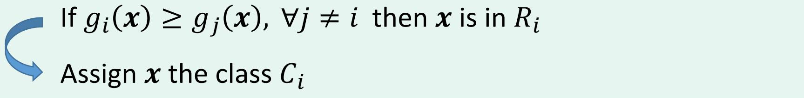

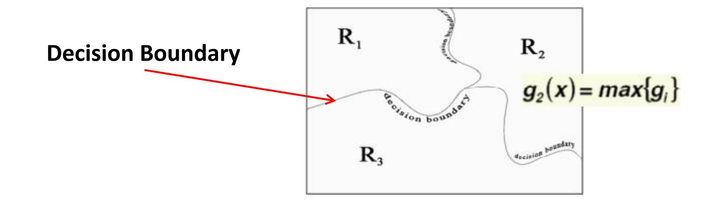

### **Bayes Decision Rule**

先验概率

Prior: A priori probability  $p(C_i)$   $\sum_{i=1}^{M} p(C_i) = 1$ 

证据因子

**Evidence**: Probability density of feature x: p(x)

似然(类条件概率)

**Likelihood**: Class-conditional probability density:  $p(x|C_i)$ 

后验概率

**Posterior**: Probability of class  $C_i$  for a given feature value x:  $p(C_i|x)$ 

$$p(C_i|\mathbf{x}) = \frac{p(C_i)p(\mathbf{x}|C_i)}{p(\mathbf{x})} \qquad posterior = \frac{prior \times likelihood}{evidence}$$

## **Bayes Decision Rule**

- Consider the binary classification.
- Probability of error when observing x:

$$p(e|\mathbf{x}) = p(C_1|\mathbf{x})$$
 if we decide  $C_2$   
 $p(e|\mathbf{x}) = p(C_2|\mathbf{x})$  if we decide  $C_1$ 

Average probability of error

$$p(e) = \int_{-\infty}^{\infty} p(e|x)p(x)dx$$

Bayes decision rule for minimizing the probability of error:

decide 
$$C_1$$
 if  $p(C_1|x) > p(C_2|x)$ ; otherwise decide  $C_2$ 

### **Bayes Error Rate—Minimum Error Rate**

• Bayes decision rule for minimizing the probability of error:

decide 
$$C_1$$
 if  $p(C_1|\mathbf{x}) > (C_2|\mathbf{x})$ ; otherwise decide  $C_2$ 

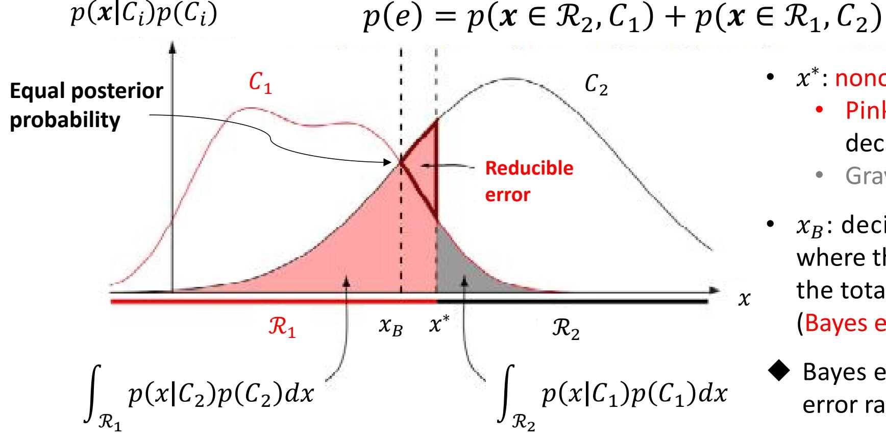

- $x^*$ : nonoptimal decision point.
  - Pink area: the probability of errors for deciding  $C_1$  when the nature is  $C_2$ ;
  - Gray area: the converse.
- $x_B$ : decision boundary of Bayes decision, where the reducible error is eliminated and the total shaded area is minimum possible (Bayes error rate).
- ◆ Bayes error rate: the minimum achievable error rate for a classification problem.

# Why Gaussian

#### Analytical tractability

- $\triangleright$  ( $\mu$ ,  $\Sigma$ ) are sufficient to uniquely characterize the distribution.
- $\triangleright$  If (Gaussian)  $x_i$ 's are mutually uncorrelated, then they are independent.
- > The marginal and conditional densities are also Gaussian.

### Ubiquity-Frequently observed

> Central limit theorem (Many distributions we wish to model are truly close to being normal distributions.

# Normal/Gaussian Distribution of a Random Variable

Probability density function:

$$p(x) = \frac{1}{\sqrt{2\pi}\sigma} exp\left[-\frac{1}{2}(\frac{x-\mu}{\sigma})^2\right]$$

- $\mu$  = mean (or expected value) of x
- $\sigma^2$  = expected squared deviation or variance

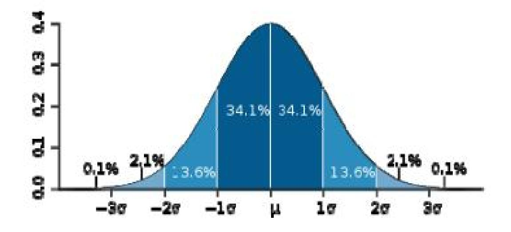

### Gaussian

Multivariate Gaussian

$$p(\mathbf{x}) = \frac{1}{(2\pi)^{d/2} |\mathbf{\Sigma}|^{1/2}} exp\left[-\frac{1}{2}(\mathbf{x} - \boldsymbol{\mu})^T \mathbf{\Sigma}^{-1} (\mathbf{x} - \boldsymbol{\mu})\right]$$

- $\mu = (\mu_1, \mu_2, ..., \mu_d)^T$ : mean vector
- $\Sigma \in \mathbb{R}^{d \times d}$ : covariance matrix
- $|\Sigma|$ : determinant
- $\Sigma^{-1}$ : inverse

$$\mathbf{\Sigma} = \begin{bmatrix} \sigma_1^2 & \cdots & \sigma_{1d} \\ \vdots & \ddots & \vdots \\ \sigma_{d1} & \cdots & \sigma_d^2 \end{bmatrix}$$

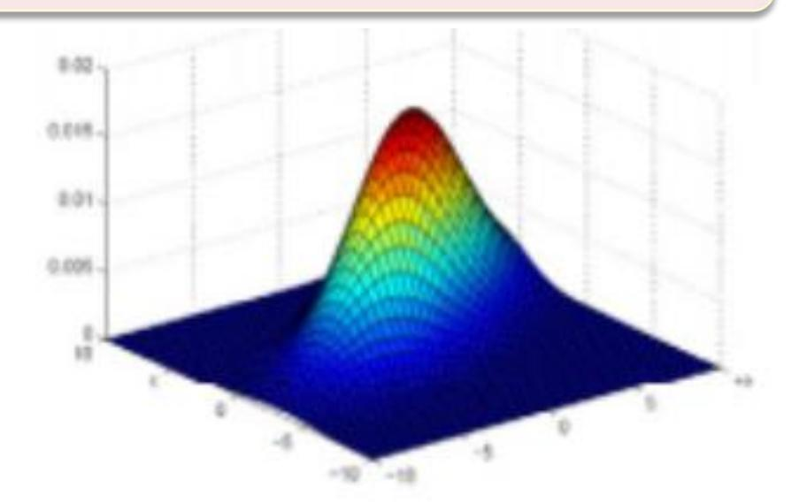

### **Covariance Matrix**

- The diagonal elements are variances of each feature
- Relationship between any two features  $x_i$  and  $x_j$ 
  - Independent  $\sigma_{ij} = 0$
  - Positive correlation  $\sigma_{ij} > 0$
  - Negative correlation  $\sigma_{ij} < 0$

$$\mathbf{\Sigma} = \begin{bmatrix} \sigma_{1}^2 & \cdots & \sigma_{1d} \\ \vdots & \ddots & \vdots \\ \sigma_{d1} & \cdots & \sigma_{d}^2 \end{bmatrix}$$

• **If Σ** is diagonal (对角矩阵):

$$p(\mathbf{x}) = \frac{1}{(2\pi)^{d/2} |\mathbf{\Sigma}|^{1/2}} exp\left[-\frac{1}{2} (\mathbf{x} - \boldsymbol{\mu})^T \mathbf{\Sigma}^{-1} (\mathbf{x} - \boldsymbol{\mu})\right]$$
$$p(\mathbf{x}) = \prod_{i=1}^d \frac{1}{\sqrt{2\pi}\sigma_i} exp\left[-\frac{1}{2} (\frac{x_i - \mu_i}{\sigma_i})^2\right]$$

### **Mahalanobis Distance**

Probability density function:

$$p(x) = \frac{1}{(2\pi)^{d/2} |\Sigma|^{1/2}} exp \left[ -\frac{1}{2} (x - \mu)^T \Sigma^{-1} (x - \mu) \right]$$

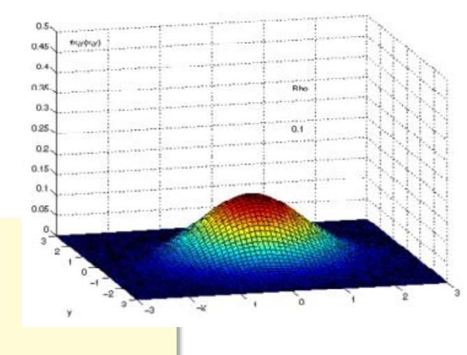

- **Mean vector**:  $\mu$  Covariance matrix: Σ
- Mahalanobis distance:  $\sqrt{(x \mu)^T \Sigma^{-1} (x \mu)}$ 
  - $\checkmark$  Represents the distance of the test point x from the mean  $\mu$ .
  - ✓ If  $\Sigma = I$ , Mahalanobis distance  $\leftrightarrow$  Euclidean distance.

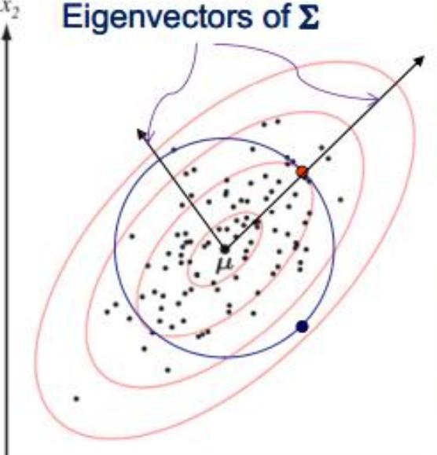

Mahalanobis Distance:  $\sqrt{(x-\mu)^T \Sigma^{-1}(x-\mu)}$ 

Points of equal Mahalanobis distance to the mean lie on an ellipse.

Euclidean Distance:  $\sqrt{(x-\mu)^T(x-\mu)}$ 

Points of equal Euclidean distance to the mean lie on a circle.

# **Independent Gaussian Models**

■ Special Case: Assume that  $x_1$  and  $x_2$  are independent.

$$p(x_1) = \frac{1}{\sqrt{2\pi}\sigma_1} exp\left[-\frac{1}{2}(\frac{x_1 - \mu_1}{\sigma_1})^2\right] \qquad p(x_2) = \frac{1}{\sqrt{2\pi}\sigma_2} exp\left[-\frac{1}{2}(\frac{x_2 - \mu_2}{\sigma_2})^2\right]$$

$$p(x_1)p(x_2) = \frac{1}{2\pi\sigma_1\sigma_2} exp\left[\frac{1}{2}(\mathbf{x} - \boldsymbol{\mu})^T \boldsymbol{\Sigma}^{-1}(\mathbf{x} - \boldsymbol{\mu})\right]$$
$$\mathbf{x} = [x_1 \ x_2] \qquad \qquad \boldsymbol{\mu} = [\mu_1 \ \mu_2] \qquad \qquad \boldsymbol{\Sigma} = diag(\sigma_1^2, \sigma_2^2)$$

$$\boldsymbol{\mu} = \begin{bmatrix} 0 \\ 0 \end{bmatrix} \boldsymbol{\Sigma} = \begin{bmatrix} 1 & 0 \\ 0 & 1 \end{bmatrix}$$

$$\boldsymbol{\mu} = \begin{bmatrix} 0 \\ 0 \end{bmatrix} \boldsymbol{\Sigma} = \begin{bmatrix} 1 & 0 \\ 0 & 1 \end{bmatrix} \qquad \boldsymbol{\mu} = \begin{bmatrix} 0 \\ 0 \end{bmatrix} \boldsymbol{\Sigma} = \begin{bmatrix} 0.6 & 0 \\ 0 & 0.6 \end{bmatrix} \qquad \boldsymbol{\mu} = \begin{bmatrix} 0 \\ 0 \end{bmatrix} \boldsymbol{\Sigma} = \begin{bmatrix} 2 & 0 \\ 0 & 2 \end{bmatrix}$$

$$\boldsymbol{\mu} = \begin{bmatrix} 0 \\ 0 \end{bmatrix} \boldsymbol{\Sigma} = \begin{bmatrix} 2 & 0 \\ 0 & 2 \end{bmatrix}$$


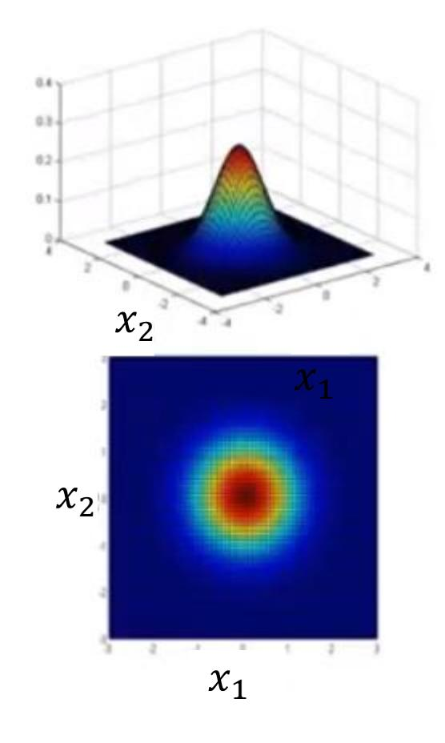

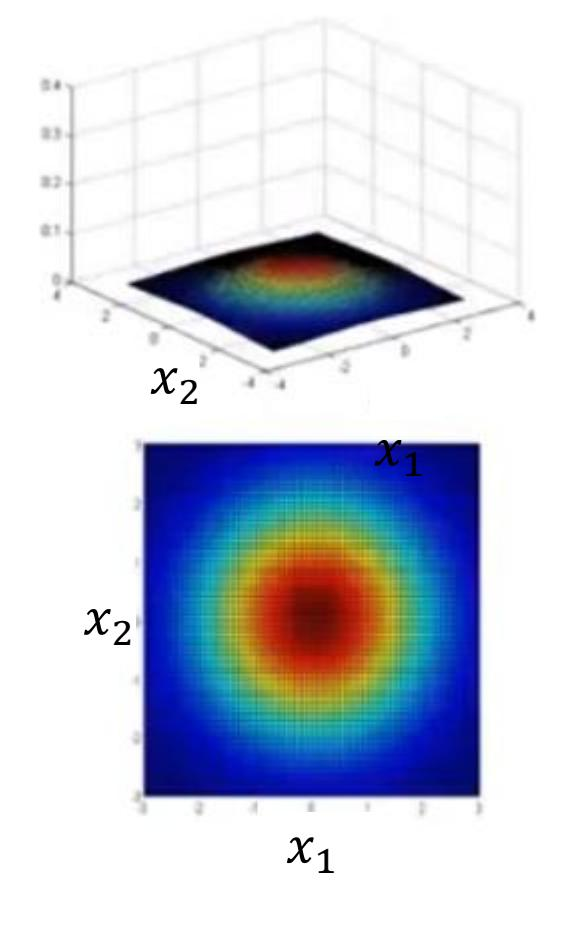

$$\boldsymbol{\mu} = \begin{bmatrix} 0 \\ 0 \end{bmatrix} \boldsymbol{\Sigma} = \begin{bmatrix} 1 & 0 \\ 0 & 1 \end{bmatrix}$$

$$\boldsymbol{\mu} = \begin{bmatrix} 0 \\ 0 \end{bmatrix} \boldsymbol{\Sigma} = \begin{bmatrix} 1 & 0 \\ 0 & 1 \end{bmatrix} \qquad \boldsymbol{\mu} = \begin{bmatrix} 0 \\ 0 \end{bmatrix} \boldsymbol{\Sigma} = \begin{bmatrix} 0.6 & 0 \\ 0 & 1 \end{bmatrix} \qquad \boldsymbol{\mu} = \begin{bmatrix} 0 \\ 0 \end{bmatrix} \boldsymbol{\Sigma} = \begin{bmatrix} 2 & 0 \\ 0 & 1 \end{bmatrix}$$

$$\boldsymbol{\mu} = \begin{bmatrix} 0 \\ 0 \end{bmatrix} \boldsymbol{\Sigma} = \begin{bmatrix} 2 & 0 \\ 0 & 1 \end{bmatrix}$$

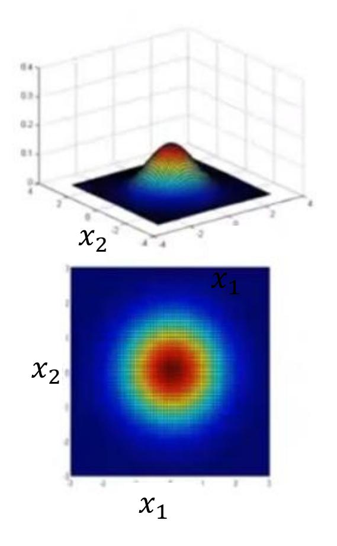


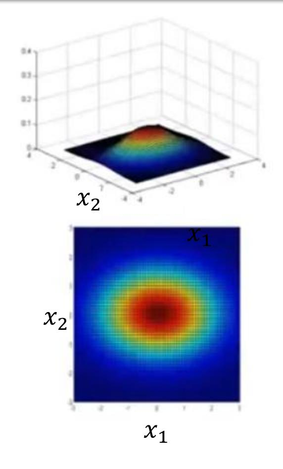

$$\mu = \begin{bmatrix} 0 \\ 0 \end{bmatrix} \mathbf{\Sigma} = \begin{bmatrix} 1 & 0 \\ 0 & 1 \end{bmatrix}$$

$$\boldsymbol{\mu} = \begin{bmatrix} 0 \\ 0 \end{bmatrix} \boldsymbol{\Sigma} = \begin{bmatrix} 1 & 0 \\ 0 & 1 \end{bmatrix} \qquad \boldsymbol{\mu} = \begin{bmatrix} 0 \\ 0 \end{bmatrix} \boldsymbol{\Sigma} = \begin{bmatrix} 1 & 0 \\ 0 & 0.6 \end{bmatrix} \qquad \boldsymbol{\mu} = \begin{bmatrix} 0 \\ 0 \end{bmatrix} \boldsymbol{\Sigma} = \begin{bmatrix} 1 & 0 \\ 0 & 2 \end{bmatrix}$$

$$\mu = \begin{bmatrix} 0 \\ 0 \end{bmatrix} \mathbf{\Sigma} = \begin{bmatrix} 1 & 0 \\ 0 & 2 \end{bmatrix}$$

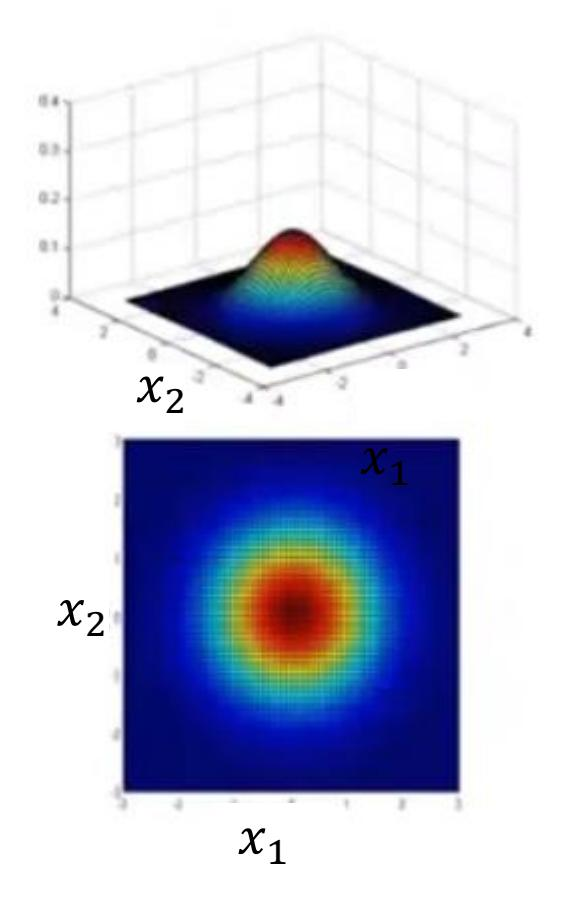

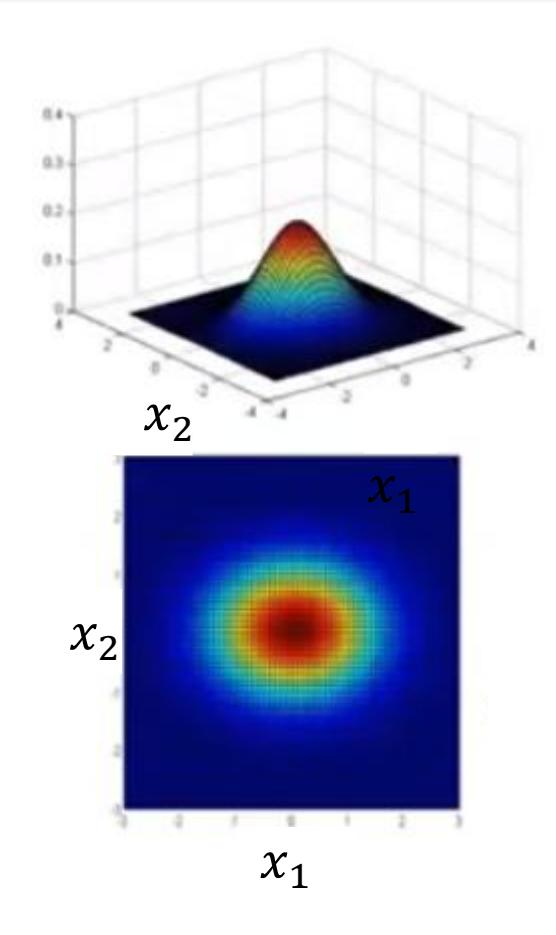

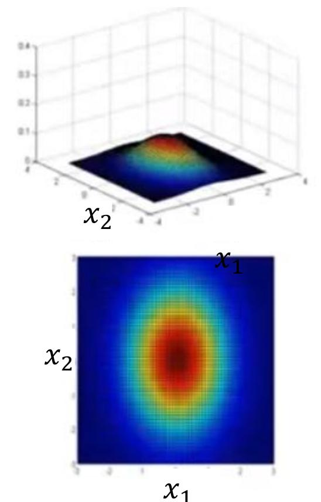

$$\boldsymbol{\mu} = \begin{bmatrix} 0 \\ 0 \end{bmatrix} \boldsymbol{\Sigma} = \begin{bmatrix} 1 & 0 \\ 0 & 1 \end{bmatrix}$$

$$\boldsymbol{\mu} = \begin{bmatrix} 0 \\ 0 \end{bmatrix} \boldsymbol{\Sigma} = \begin{bmatrix} 1 & 0.5 \\ 0.5 & 1 \end{bmatrix}$$

$$\boldsymbol{\mu} = \begin{bmatrix} 0 \\ 0 \end{bmatrix} \boldsymbol{\Sigma} = \begin{bmatrix} 1 & 0 \\ 0 & 1 \end{bmatrix} \qquad \boldsymbol{\mu} = \begin{bmatrix} 0 \\ 0 \end{bmatrix} \boldsymbol{\Sigma} = \begin{bmatrix} 1 & 0.5 \\ 0.5 & 1 \end{bmatrix} \qquad \boldsymbol{\mu} = \begin{bmatrix} 0 \\ 0 \end{bmatrix} \boldsymbol{\Sigma} = \begin{bmatrix} 1 & 0.8 \\ 0.8 & 1 \end{bmatrix}$$

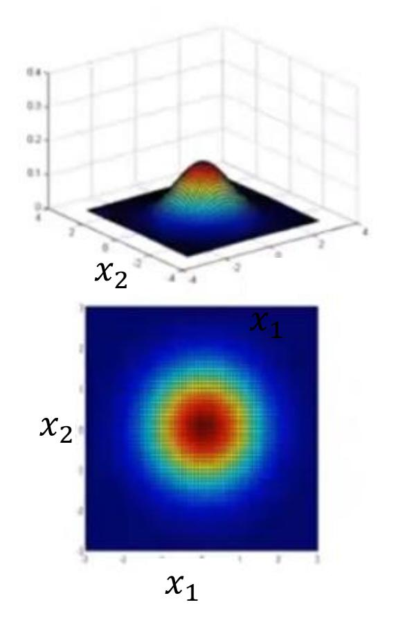

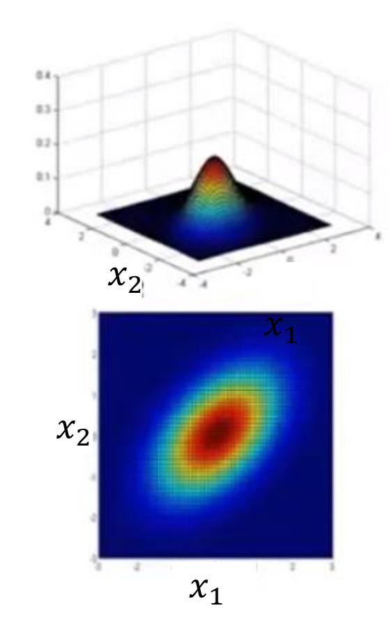

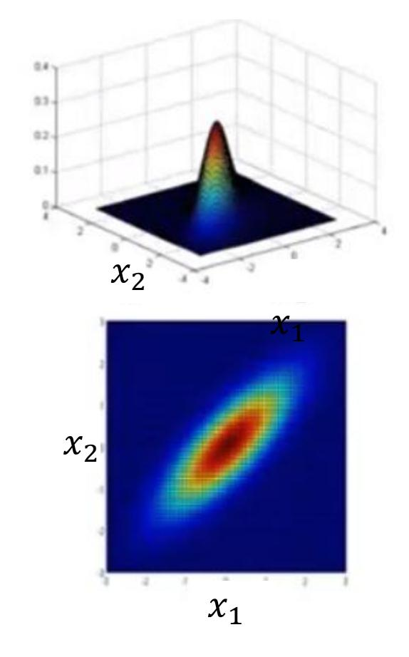

### **Discriminant Functions for Gaussian**

For the minimum error rate, we take

$$g_i(\mathbf{x}) = \ln p(C_i|\mathbf{x}) \propto \ln p(\mathbf{x}|C_i) + \ln p(C_i)$$

Case of multivariate Gaussian

$$p(\mathbf{x}|C_i) = \frac{1}{(2\pi)^{d/2}|\mathbf{\Sigma}_i|^{1/2}} exp\left[-\frac{1}{2}(\mathbf{x} - \boldsymbol{\mu}_i)^T \mathbf{\Sigma}_i^{-1} (\mathbf{x} - \boldsymbol{\mu}_i)\right]$$

$$g_i(\mathbf{x}) = -\frac{1}{2}(\mathbf{x} - \boldsymbol{\mu}_i)^T \boldsymbol{\Sigma}_i^{-1} (\mathbf{x} - \boldsymbol{\mu}_i) - \frac{1}{2} \ln|\boldsymbol{\Sigma}_i| + \ln p(C_i)$$

# Case 1: $\Sigma_i = \sigma^2 I$ (单位矩阵)

All features are independent and have the same variance for all classes.

$$g_i(\mathbf{x}) = -\frac{1}{2}(\mathbf{x} - \boldsymbol{\mu}_i)^T \boldsymbol{\Sigma}_i^{-1}(\mathbf{x} - \boldsymbol{\mu}_i) - \frac{1}{2} \ln|\boldsymbol{\Sigma}_i| + \ln p(C_i)$$
Euclidean distance  $\|\mathbf{x} - \boldsymbol{\mu}_i\|^2$ 

$$g_i(\mathbf{x}) = -\frac{1}{2\sigma^2} (\mathbf{x} - \boldsymbol{\mu}_i)^T (\mathbf{x} - \boldsymbol{\mu}_i) + \ln p(C_i)$$

$$g_i(\mathbf{x}) = -\frac{1}{2\sigma^2} (-2\boldsymbol{\mu}_i^T \mathbf{x} + \boldsymbol{\mu}_i^T \boldsymbol{\mu}_i) + \ln p(C_i)$$

• Linear discriminant function  $g_i(x) = w_i^T x_i^! + w_{i0}^!$  bias

$$\mathbf{w}_i = \frac{\boldsymbol{\mu}_i}{\sigma^2} \qquad \qquad \mathbf{w}_{i0} = -\frac{\boldsymbol{\mu}_i^T \boldsymbol{\mu}_i}{2\sigma^2} + \ln p(C_i)$$

## Case 1: $\Sigma_i = \sigma^2 I$

Minimum Distance Classifier

$$g_i(\mathbf{x}) = -\frac{1}{2\sigma^2} (\mathbf{x} - \boldsymbol{\mu}_i)^T (\mathbf{x} - \boldsymbol{\mu}_i) + \ln p(C_i)$$

$$g_i(x) = -(x - \mu_i)^T(x - \mu_i)$$
 Assume equal priors

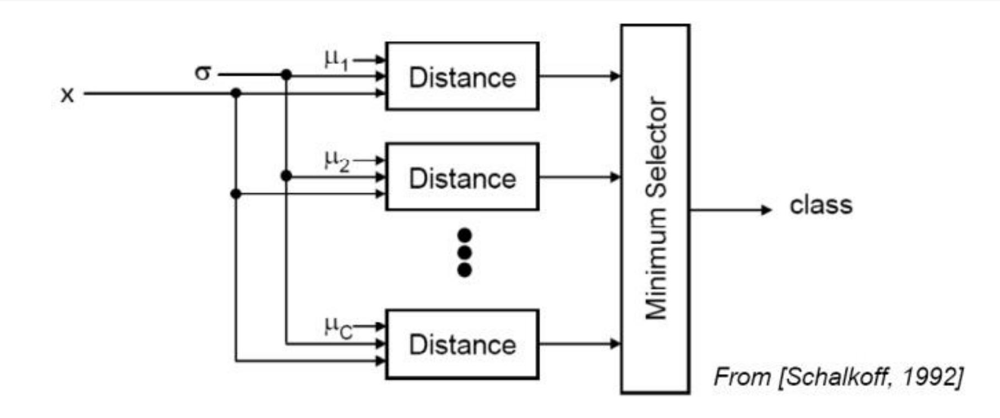

## Case 1: $\Sigma_i = \sigma^2 I$

- A classifier that uses *linear discriminant functions* is called "a linear machine"
- The decision surfaces for a linear machine are pieces of hyperplanes defined by

$$g_i(\mathbf{x}) = g_j(\mathbf{x})$$

$$-\frac{1}{2\sigma^{2}}(-2\mu_{i}^{T}x + \mu_{i}^{T}\mu_{i}) + \ln p(C_{i}) = -\frac{1}{2\sigma^{2}}(-2\mu_{j}^{T}x + \mu_{j}^{T}\mu_{j}) + \ln p(C_{j})$$

$$\left(\mu_{i}^{T}x - \frac{1}{2}\mu_{i}^{T}\mu_{i}\right) + \sigma^{2}\ln p(C_{i}) = \left(\mu_{j}^{T}x - \frac{1}{2}\mu_{j}^{T}\mu_{j}\right) + \sigma^{2}\ln p(C_{j})$$

$$(\mu_{i} - \mu_{j})^{T}x - \frac{1}{2}(\mu_{i} - \mu_{j})^{T}(\mu_{i} + \mu_{j}) + \sigma^{2}\ln \frac{p(C_{i})}{p(C_{j})} = 0$$

The hyperplane separating  $R_i$  and  $R_j$  always orthogonal to the line linking the means!

## Case 1: $\Sigma_i = \sigma^2 I$

$$(\mu_i - \mu_j)^T x - \frac{1}{2} (\mu_i - \mu_j)^T (\mu_i + \mu_j) + \sigma^2 \ln \frac{p(C_i)}{p(C_j)} = 0$$

$$(\mu_i - \mu_j)^T \left[ x - \left( \frac{1}{2} (\mu_i + \mu_j) - \frac{\sigma^2}{\|(\mu_i - \mu_j)\|^2} \ln \frac{p(C_i)}{p(C_j)} (\mu_i - \mu_j) \right) \right] = 0$$

$$\left(\boldsymbol{\mu}_i - \boldsymbol{\mu}_j\right)^T (\boldsymbol{x} - \boldsymbol{x}_0) = 0$$

If 
$$p(C_i) = p(C_j)$$
, then  $\mathbf{x}_0 = \frac{1}{2}(\boldsymbol{\mu}_i + \boldsymbol{\mu}_j)$ 

The mean  $\frac{1}{2}(\mu_i + \mu_j)$  is on the hyperplane (i.e, the hyperplane passes through it).

# Decision surface for Case 1: $\Sigma_i = \sigma^2 I$

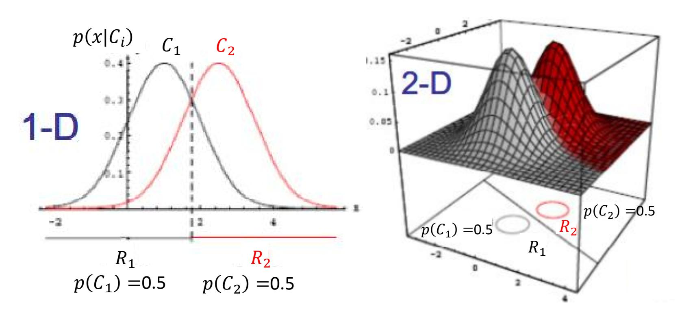

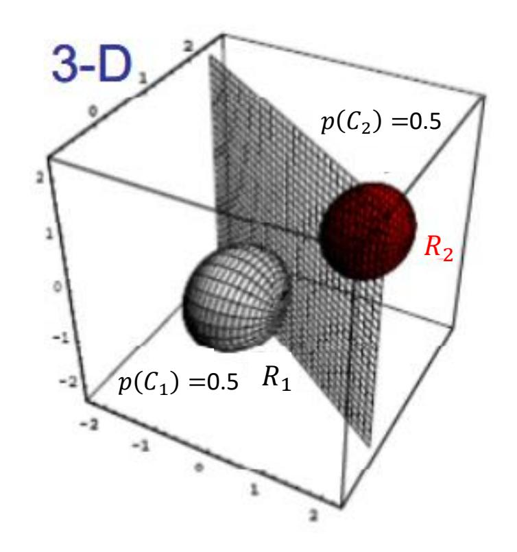

## **Priors and Decision Boundary**

$$(\boldsymbol{\mu}_i - \boldsymbol{\mu}_j)^T \left[ \boldsymbol{x} - \left( \frac{1}{2} \left( \boldsymbol{\mu}_i + \boldsymbol{\mu}_j \right) - \frac{\sigma^2}{\left\| \left( \boldsymbol{\mu}_i - \boldsymbol{\mu}_j \right) \right\|^2} \ln \frac{p(C_i)}{p(C_j)} (\boldsymbol{\mu}_i - \boldsymbol{\mu}_j) \right) \right]$$

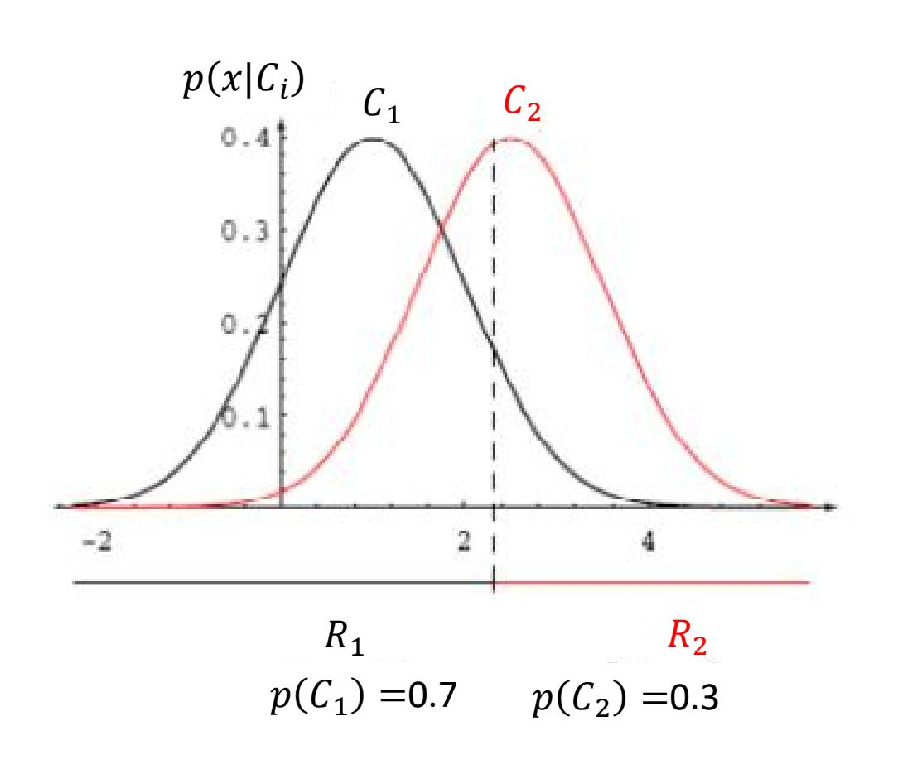

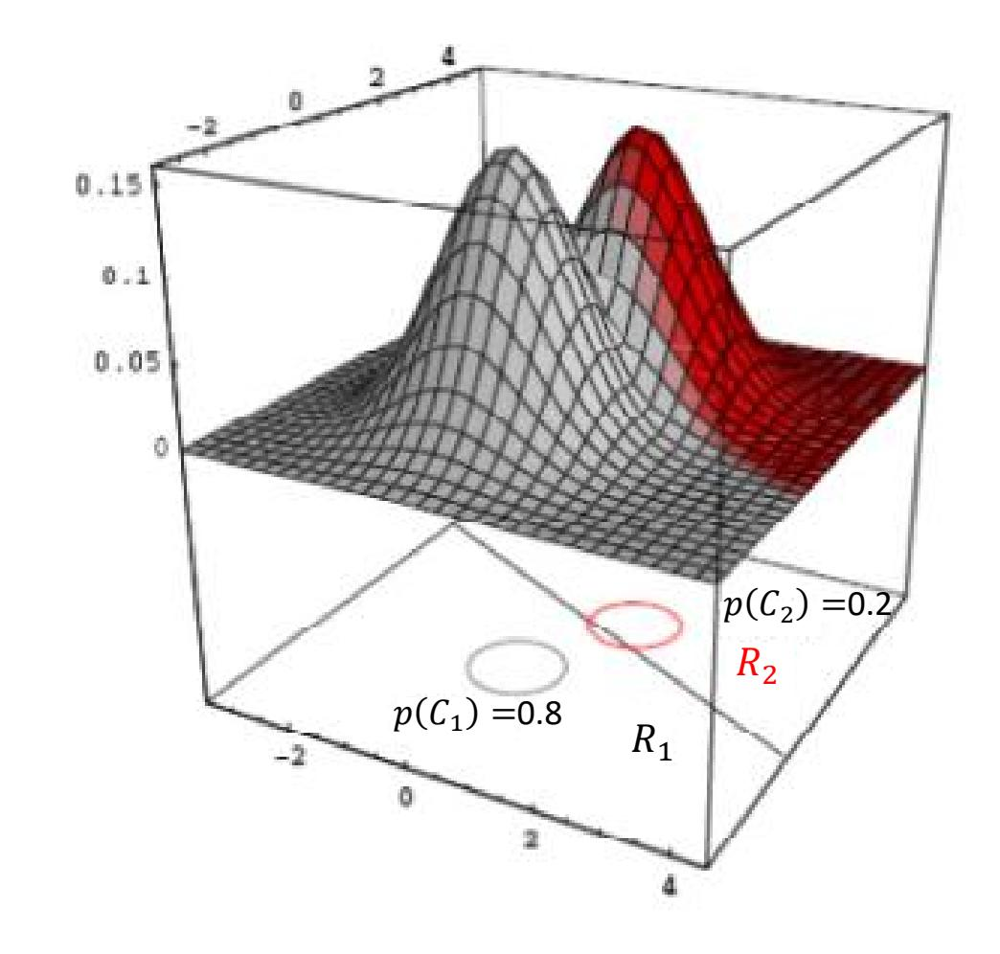

## Case 2: $\Sigma_i = \Sigma$

Covariance of all classes are identical but arbitrary

$$g_i(\mathbf{x}) = -\frac{1}{2}(\mathbf{x} - \boldsymbol{\mu}_i)^T \boldsymbol{\Sigma}_i^{-1} (\mathbf{x} - \boldsymbol{\mu}_i) - \frac{1}{2} \ln|\boldsymbol{\Sigma}_i| + \ln p(C_i)$$

$$g_i(\mathbf{x}) = -\frac{1}{2}(\mathbf{x} - \boldsymbol{\mu}_i)^T \boldsymbol{\Sigma}^{-1}(\mathbf{x} - \boldsymbol{\mu}_i) + \ln p(C_i)$$

- Squared Mahalanobis Distance
  - $(x-\mu_i)^T \Sigma^{-1} (x-\mu_i)$

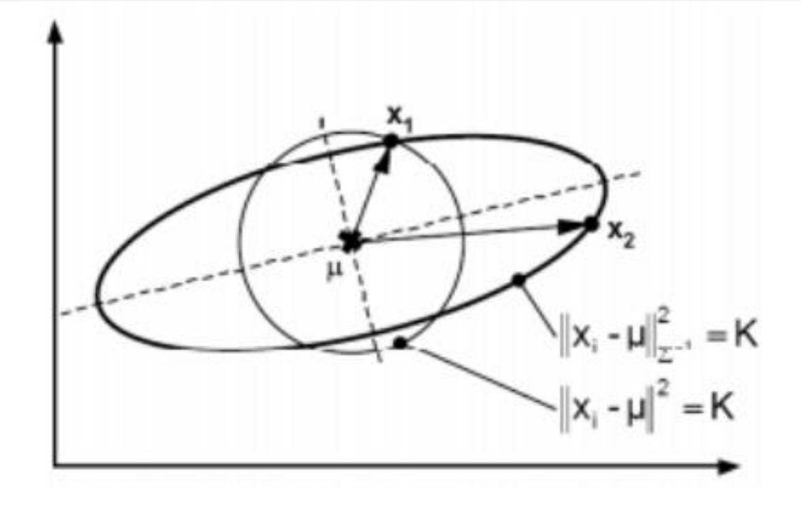

### Mahalanobis Distance vs Euclidean Distance

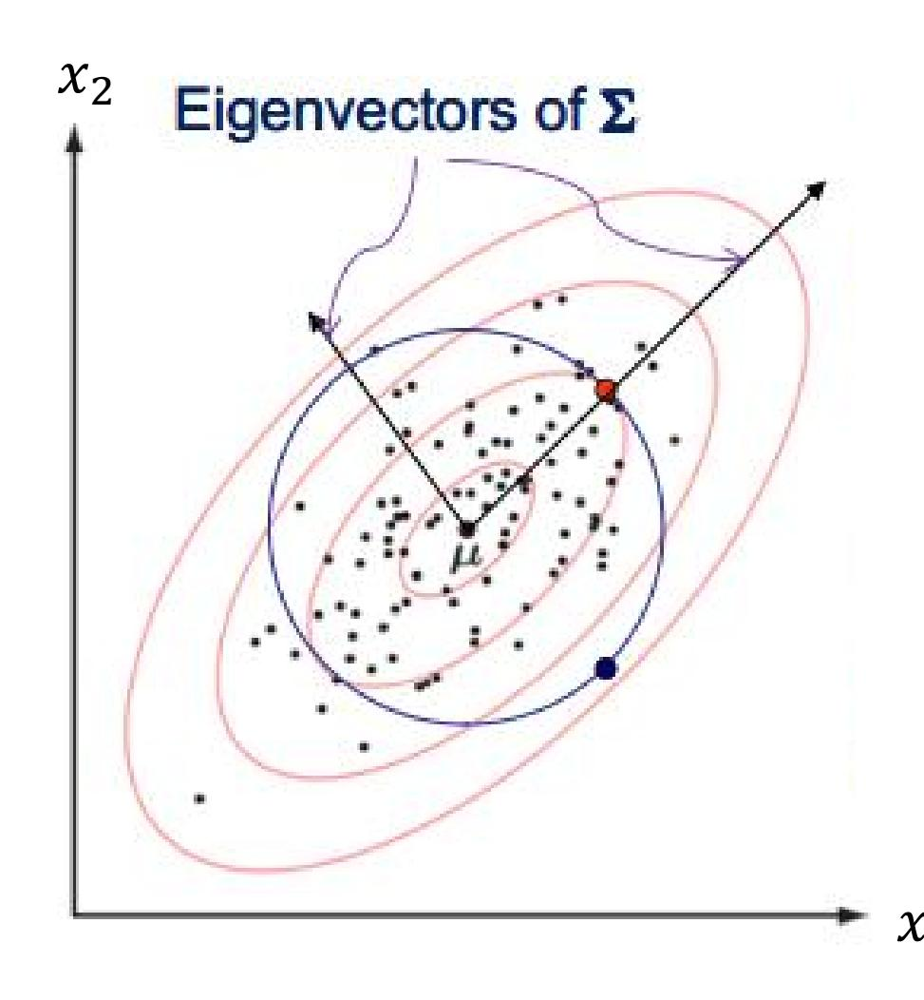

#### Mahalanobis Distance

- $\sqrt{(x-\mu_i)^T\Sigma^{-1}(x-\mu_i)}$
- Points of equal Mahalanobis distance to the mean lies on an ellipse.

#### • Euclidean Distance

• 
$$\sqrt{(x-\mu_i)^T(x-\mu_i)}$$

• Points of equal Euclidean distance to the mean lies on a circle.

## Case 2: $\Sigma_i = \Sigma$

Covariance of all classes are identical but arbitrary

$$g_{i}(x) = -\frac{1}{2}(x - \mu_{i})^{T} \Sigma_{i}^{-1}(x - \mu_{i}) - \frac{1}{2} \ln|\Sigma_{i}| + \ln p(C_{i})$$

$$g_{i}(x) = -\frac{1}{2}(x - \mu_{i})^{T} \Sigma^{-1}(x - \mu_{i}) + \ln p(C_{i})$$

Linear discriminant function

$$g_i(\mathbf{x}) = \mathbf{w}_i^T \mathbf{x} + \mathbf{w}_{i0} \text{ bias}$$

$$\mathbf{w}_i = \mathbf{\Sigma}^{-1} \boldsymbol{\mu}_i \qquad \qquad \mathbf{w}_{i0} = -\frac{1}{2} \boldsymbol{\mu}_i^T \mathbf{\Sigma}^{-1} \boldsymbol{\mu}_i + \ln p(C_i)$$

## Decision Boundaries for Case 2: $\Sigma_i = \Sigma$

$$g_i(\mathbf{x}) = g_j(\mathbf{x})$$

$$-\frac{1}{2}(\mathbf{x} - \boldsymbol{\mu}_i)^T \boldsymbol{\Sigma}^{-1}(\mathbf{x} - \boldsymbol{\mu}_i) + \ln p(C_i) = -\frac{1}{2}(\mathbf{x} - \boldsymbol{\mu}_j)^T \boldsymbol{\Sigma}^{-1}(\mathbf{x} - \boldsymbol{\mu}_j) + \ln p(C_j)$$

$$\left(\boldsymbol{\mu}_i^T \boldsymbol{\Sigma}^{-1} \mathbf{x} - \frac{1}{2} \boldsymbol{\mu}_i^T \boldsymbol{\Sigma}^{-1} \boldsymbol{\mu}_i\right) + \ln p(C_i) = \left(\boldsymbol{\mu}_j^T \boldsymbol{\Sigma}^{-1} \mathbf{x} - \frac{1}{2} \boldsymbol{\mu}_j^T \boldsymbol{\Sigma}^{-1} \boldsymbol{\mu}_j\right) + \ln p(C_j)$$

$$(\mathbf{\Sigma}^{-1}\boldsymbol{\mu}_i - \mathbf{\Sigma}^{-1}\boldsymbol{\mu}_j)^T \boldsymbol{x} - \frac{1}{2} (\boldsymbol{\mu}_i - \boldsymbol{\mu}_j)^T \mathbf{\Sigma}^{-1} (\boldsymbol{\mu}_i + \boldsymbol{\mu}_j) + \ln \frac{p(C_i)}{p(C_j)} = 0$$

The hyperplane separating  $R_i$  and  $R_j$  is generally not orthogonal to the line linking the means!

## Decision Boundaries for Case 2: $\Sigma_i = \Sigma$

$$(\mathbf{\Sigma}^{-1}\boldsymbol{\mu}_i - \mathbf{\Sigma}^{-1}\boldsymbol{\mu}_j)^T \boldsymbol{x} - \frac{1}{2} (\boldsymbol{\mu}_i - \boldsymbol{\mu}_j)^T \mathbf{\Sigma}^{-1} (\boldsymbol{\mu}_i + \boldsymbol{\mu}_j) + \ln \frac{p(C_i)}{p(C_j)} = 0$$

$$(\mathbf{\Sigma}^{-1}\boldsymbol{\mu}_{i} - \mathbf{\Sigma}^{-1}\boldsymbol{\mu}_{j})^{T} \left( \mathbf{x} - \frac{1}{2} \left( \boldsymbol{\mu}_{i} + \boldsymbol{\mu}_{j} \right) + \frac{\ln p(C_{i})/p(C_{j})}{\left( \boldsymbol{\mu}_{i} - \boldsymbol{\mu}_{j} \right)^{T} \mathbf{\Sigma}^{-1} \left( \boldsymbol{\mu}_{i} - \boldsymbol{\mu}_{j} \right)} (\boldsymbol{\mu}_{i} - \boldsymbol{\mu}_{j}) \right) = 0$$

$$\left(\mathbf{\Sigma}^{-1}\boldsymbol{\mu}_i - \mathbf{\Sigma}^{-1}\boldsymbol{\mu}_j\right)^T(\boldsymbol{x} - \boldsymbol{x}_0) = 0$$

If  $p(C_i) = p(C_j)$ , then  $x_0 = \frac{1}{2}(\mu_i + \mu_j)$ , which is on the hyperplane (i.e, the hyperplane passes through it).

## Case 3: $\Sigma_i = \sigma_i^2 I$

• Each class has a different covariance matrix, proportional to the *identity* matrix.

$$g_i(\mathbf{x}) = -\frac{1}{2}(\mathbf{x} - \boldsymbol{\mu}_i)^T \boldsymbol{\Sigma}_i^{-1} (\mathbf{x} - \boldsymbol{\mu}_i) - \frac{1}{2} \ln|\boldsymbol{\Sigma}_i| + \ln p(C_i)$$

Quadratic discriminant function

$$g_i(x) = -\frac{1}{2\sigma_i^2} (x - \mu_i)^T (x - \mu_i) - \frac{d}{2} \ln(\sigma_i^2) + \ln p(C_i)$$

Case 3: 
$$\Sigma_i = \sigma_i^2 I$$

$$g_i(\mathbf{x}) = -\frac{1}{2\sigma_i^2} (\mathbf{x} - \boldsymbol{\mu}_i)^T (\mathbf{x} - \boldsymbol{\mu}_i) - \frac{d}{2} \ln(\sigma_i^2) + \ln p(C)$$

Decision boundary

$$\mu_{1} = [3 \ 3]^{T} \qquad \mu_{2} = [-3 \ -3]^{T} \qquad \sigma_{1} = 2 \qquad \sigma_{2} = 4$$

$$g_{1}(x) = g_{2}(x)$$

$$-\frac{1}{8}(x - \mu_{1})^{T}(x - \mu_{1}) - \ln(4) + \ln p(C_{1}) = -\frac{1}{32}(x - \mu_{2})^{T}(x - \mu_{2}) - \ln(16) + \ln p(C_{2})$$

$$-4(x - \mu_{1})^{T}(x - \mu_{1}) - 32\ln(4) + 32\ln r = -(x - \mu_{2})^{T}(x - \mu_{2}) - 32\ln(16)$$

$$-3x^{T}x + \mu_{2}^{T}\mu_{2} - 4\mu_{1}^{T}\mu_{1} + 8x^{T}\mu_{1} - 2x^{T}\mu_{2} - 32\ln\left(\frac{1}{4}\right) + 32\ln r = 0$$

$$x^{T}x - \frac{10}{3}x^{T}\mu_{1} + 18 - \frac{32}{3}\ln 4 - \frac{32}{3}\ln r = 0$$

$$r = p(C_{1})/p(C_{2})$$

 $\left(x - \begin{bmatrix} 5 \\ 5 \end{bmatrix}\right)^{1} \left(x - \begin{bmatrix} 5 \\ 5 \end{bmatrix}\right) = 32\left(1 + \frac{\ln 4r}{3}\right)$ 

## Case 4: $\Sigma_i$ = arbitrary

Each class has a different covariance matrix.

$$g_i(\mathbf{x}) = -\frac{1}{2}(\mathbf{x} - \boldsymbol{\mu}_i)^T \boldsymbol{\Sigma}_i^{-1} (\mathbf{x} - \boldsymbol{\mu}_i) - \frac{1}{2} \ln|\boldsymbol{\Sigma}_i| + \ln p(C_i)$$

Quadratic discriminant function

$$g_i(\mathbf{x}) = \mathbf{x}^T \mathbf{W}_i \mathbf{x} + \mathbf{w}_i^T \mathbf{x} + \mathbf{w}_{i0}$$

$$\mathbf{W}_i = -\frac{1}{2} \mathbf{\Sigma}_i^{-1}$$

$$\mathbf{w}_i = \mathbf{\Sigma}_i^{-1} \boldsymbol{\mu}_i$$

$$w_{i0} = -\frac{1}{2} \boldsymbol{\mu}_i^T \mathbf{\Sigma}_i^{-1} \boldsymbol{\mu}_i - \frac{1}{2} \ln|\mathbf{\Sigma}_i| + \ln p(C_i)$$

$$g_i(\mathbf{x}) = \mathbf{x}^T \mathbf{W}_i \mathbf{x} + \mathbf{w}_i^T \mathbf{x} + \mathbf{w}_{i0}$$

# **Case 4: =arbitrary**

- The decision boundaries are hyperquadrics
  - Hyperplanes, pairs of hyperplanes, hyperspheres, hyperellipsoids, hyperparaboloids, hyperhyperboloids.

超平面,超平面对,超球面,超椭球,超抛物面,超双曲面

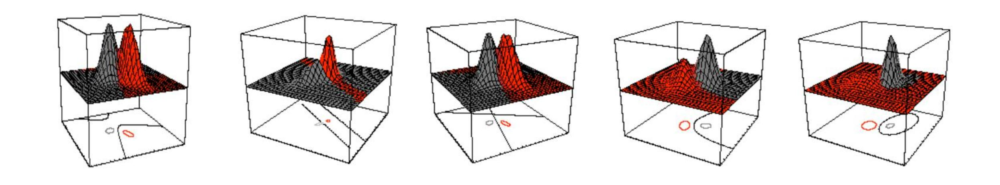

# **Case 4: =arbitrary**

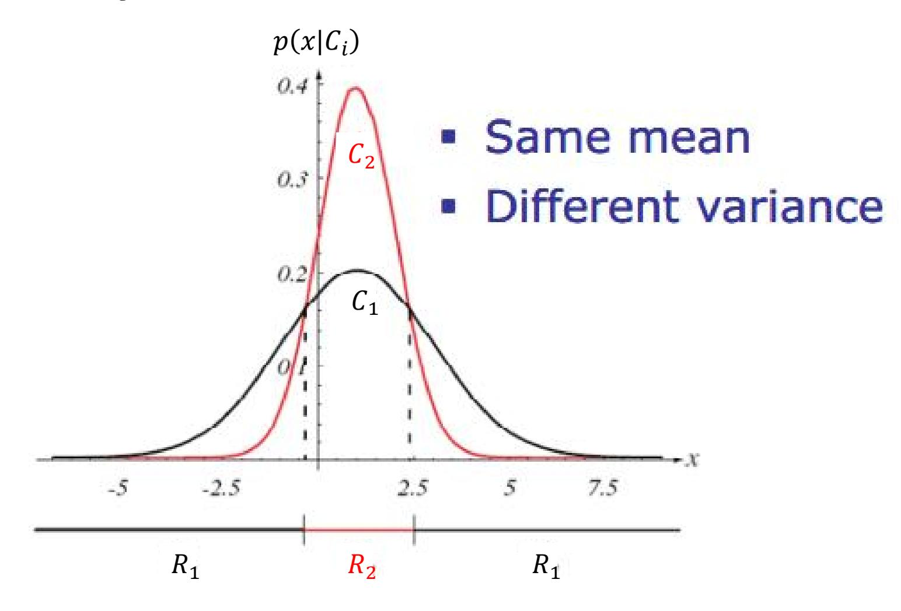

Non-simply connected decision regions can arise for Gaussians having unequal variance.

## **Summary**

- The Bayes classifier for normally distributed classes (general case) is a quadratic classifier.
- The Bayes classifier for normally distributed classes with equal covariance matrices is a linear classifier.

# **Naïve Bayes Classifier**

## **Naïve Bayes Classifier**

A **Naive Bayes classifier** is a simple probabilistic classifier based on applying Bayes' theorem (from Bayesian statistics) with strong (naive) independence assumptions.

### **Independent feature model**

Assumes that the presence (or absence) of a particular feature of a class is unrelated to the presence (or absence) of any other feature.

For example, a fruit may be considered to be an apple if *it is red, round, and about 4" in diameter.*

Even if these features depend on each other or upon the e x i s t e n c e o f t h e o t h e r features, a naive Bayes classifier considers all of these properties to independently contribute to the probability that this fruit is an apple.

## **Naïve Bayes Classifier**

- In spite of their naive design and apparently over-simplified assumptions, naive Bayes classifiers have worked quite well in many complex real-world situations.
  - In 2004, analysis of the Bayesian classification problem has shown that there are some theoretical reasons for the apparently unreasonable efficacy of naive Bayes classifiers. [1]
- Still, a comprehensive comparison with other classification methods in 2006 showed that Bayes classification is outperformed by more current approaches, such as boosted trees or random forests. [2]
- It only requires a smallamount of training data to estimate the parameters (means and variances of the variables) necessary for classification.
- Because independent variables are assumed, only the variances of the variables for each class need to be determined and not the entire covariance matrix.

Abstractly, the probability model for a classifier is a conditional model

$$p(C|F_1,...,F_d)$$

C: outcome or class;  $F_1$ , ...,  $F_d$ : feature variables.

- Problem: if the number of features d is large or when a feature can take on a large number of values, then basing such a model on probability tables is infeasible.
- We therefore reformulate the model to make it more tractable.
- Using Bayes' theorem, we write

$$p(C|F_1, ..., F_d) = \frac{p(C)p(F_1, ..., F_d|C)}{p(F_1, ..., F_d)}$$

$$p(C|F_1, ..., F_d) = \frac{p(C)p(F_1, ..., F_d|C)}{p(F_1, ..., F_d)} \qquad p(C, F_1, ..., F_d)$$

In plain English the above equation can be written as

$$posterior = \frac{prior \times likelihood}{evidence}$$

In practice we are only interested in the numerator of that fraction, since the denominator does not depend on  $\mathcal{C}$  and the values of the features  $F_i$  are given, so that the denominator is effectively constant.

```
\begin{split} p(C,F_1,...,F_d) &= p(C)p(F_1,...,F_d|C) \\ &= p(C)p(F_1|C)p(F_2,...,F_d|C,F_1) \\ &= p(C)p(F_1|C)p(F_2|C,F_1)p(F_3,...,F_d|C,F_1,F_2) \\ &= p(C)p(F_1|C)p(F_2|C,F_1)p(F_3|C,F_1,F_2)p(F_4,...,F_d|C,F_1,F_2,F_3) \\ &= p(C)p(F_1|C)p(F_2|C,F_1)p(F_3|C,F_1,F_2)\cdots p(F_d|C,F_1,F_2,F_3,\cdots,F_{d-1}) \end{split}
```

"Naive" Assumption: each feature  $F_i$  is conditionally independent of every other feature  $F_j$  for  $j \neq i$ :

$$p(F_i|C,F_j) = p(F_i|C)$$

The joint model can be expressed as

$$p(C, F_1, \dots F_d) = p(C)P(F_1|C) P(F_2|C) P(F_3|C) \dots$$
$$= p(C) \prod_{i=1}^{d} p(F_i|C)$$

Therefore, we have,

$$p(C|F_1, ..., F_d) = \frac{1}{Z}p(C)\prod_{i=1}^d p(F_i|C)$$

where Z (the evidence) is a scaling factor dependent only on  $F_1, \dots F_d$ , i.e., a constant if the values of the feature variables are known.

$$p(C|F_1,...,F_d) = \frac{1}{Z}p(C)\prod_{i=1}^d p(F_i|C)$$
 This model is factored into a class prior  $p(C)$  and independent probability distributions

 $p(F_i|C)$ .

If there are k classes and if a model for each  $p(F_i|C = c)$  can be expressed in terms of r parameters, then the corresponding naive Bayes model has (k-1) + drkparameters.

In practice, k=2 often (binary classification) and r=1 (Bernoulli feature:  $P_r(X=$ 1) = p,  $P_r(X = 0) = 1 - p$ ) are common, and so the total number of parameters of the naive Bayes model is 2d + 1, where d is the number of features used for classification.

#### **Parameter Estimation**

- We can use the *maximum likelihood estimates* of the probabilities.
  - Given a dataset  $\mathcal{D} = \{x_1, x_2, ..., x_n\}$ , where the n samples are drawn independently from identical distribution  $p(x|\theta)$ , estimate parameters  $\theta$ .
  - ML estimate parameters  $\theta$  maximizes  $p(\mathcal{D}|\theta)$

 $\mathcal{D}$  is an i.i.d set

$$\widehat{\boldsymbol{\theta}} = \arg \max_{\boldsymbol{\theta}} p(\mathcal{D}|\boldsymbol{\theta})$$
  $p(\mathcal{D}|\boldsymbol{\theta}) = \prod_{k=1}^{n} p(\boldsymbol{x}_k|\boldsymbol{\theta})$ 

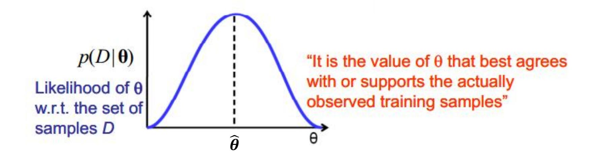

# **Maximum-Likelihood Estimation**

ML estimate parameters maximizes (, |), = 1, 2, …,

$$\widehat{\boldsymbol{\theta}} = \arg \max_{\boldsymbol{\theta}} p(\boldsymbol{X}, C | \boldsymbol{\theta})$$

- All model parameters (*i.e.*, class priors and feature probability distributions) can be approximated with relative frequencies from the training set.
- Why?

## **Maximum-Likelihood Estimation**

• All model parameters (*i.e.*, class priors and feature probability distributions) can be approximated with relative frequencies from the training set.

Let us consider the MLE for binomial distribution (N independent Bernoulli Trials),

Let  $X \sim B(N, p)$ , and the actual data (number of successes) X = k, then its likelihood is

$$L(p|k) = P(X = k|p) = C_N^k p^k (1-p)^{N-k}$$

Taking the derivative of lnL(p|k) with respect to p:  $\frac{\partial lnL(p|k)}{\partial p} = \frac{k}{p} - \frac{N-k}{1-p} = 0$ 

Then we have, 
$$p = \frac{k}{N}$$

## Parameter Estimation (Maximum-Likelihood Estimation)

Let  $X \sim B(N, p)$ , and the actual data X = k, then based on MLE, we have  $p = \frac{k}{N}$ .

• A class' prior may be estimated as (prior for a given class) = (number of samples in the class) / (total number of samples), or just assuming equiprobable classes (i.e., priors = 1 / (number of classes)).

$$p(C = c) = \frac{\sum_{i=1}^{N} I(C = c)}{N}$$
 or  $p(C = c) = \frac{1}{K}$ 

• We can estimate the independent probability distribution  $p(F_j = f_j | C = c)$  as follows:

$$p(F_j = f_j | C = c) = \frac{\sum_{i=1}^{N} I(F_j = f_j, C = c)}{\sum_{i=1}^{N} I(C = c)}$$

#### **Parameter Estimation**

- If one is dealing with continuous data, a typical assumption is that the continuous values associated with each class are distributed according to a *Gaussian* distribution.
- For example, suppose the training data contains a continuous attribute, x. We first segment the data by the class, and then compute the mean  $u_c$  and variance  $\sigma_c^2$  of x in each class c.
- Let  $u_c$  be the mean of x associated with class c, and  $\sigma_c^2$  be the variance.
- Then P(x = v | c) can be computed by plugging v into the equation as follows:

$$P(x = v|c) = \frac{1}{\sqrt{2\pi\sigma_c^2}} e^{-\frac{(v - u_c)^2}{2\sigma_c^2}}$$

### Constructing a classifier from the probability model

- The discussion so far has derived the independent feature model, that is, the naive Bayes probability model.
- The naive Bayes classifier combines this model with a decision rule.
- One common rule is to pick the hypothesis that is most probable; this is known as the maximum a posteriori or MAP decision rule.
- The corresponding classifier is defined as follows:

classify
$$(f_1, \dots f_d) = arg\max_{c} p(C = c) \prod_{i=1}^{d} p(F_i = f_i | C = c)$$

## **Examples--Sex Classification**

**Problem**: Classify whether a given person is a male or a female based on the measured features. The features include height, weight, and foot size.

**Example training set.**

| sex                | height (feet) | weight (lbs) | foot size(inches) |  |
|--------------------|---------------|--------------|-------------------|--|
| male               | 6             | 180          | 12                |  |
| male               | 5.92 (5'11")  | 190          | 11                |  |
| male               | 5.58 (5'7")   | 170          | 12                |  |
| male               | 5.92 (5'11")  | 165          | 10                |  |
| female             | 5             | 100          | 6                 |  |
| female             | 5.5 (5'6")    | 150          | 50 8              |  |
| female             | 5.42 (5'5")   | 130          | 7                 |  |
| female 5.75 (5'9") |               | 150          | 9                 |  |

## **Examples--Sex Classification**

The classifier created from the training set using a Gaussian distribution assumption would be:

| sex    | mean (height) | variance (height) | mean (weight) | variance (weight) | mean (foot size) | variance (foot size) |
|--------|---------------|-------------------|---------------|-------------------|------------------|----------------------|
| male   | 5.855         | 3.5033e-02        | 176.25        | 1.2292e+02        | 11.25            | 9.1667e-01           |
| female | 5.4175        | 9.7225e-02        | 132.5         | 5.5833e+02        | 7.5              | 1.6667e+00           |

Let's say () <sup>=</sup> () <sup>=</sup> 0.5. If we determine () based on frequency in the training set, we happen to get the same answer.

## **Testing**

A testing sample to be classified as a male or female.

```
 () = () ∗ (ℎℎ|) ∗ (ℎ|) ∗ ( |) / 
 () = () ∗ (ℎℎ|) ∗ (ℎ|) ∗ ( |) / 

= () ∗ (ℎℎ|) ∗ (ℎ|) ∗ (|) + () ∗ (ℎℎ|)
∗ (ℎ|) ∗ ( |)
```

The evidence may be ignored since it is a positive constant.

## **Testing**

```
() = 0.5
(ℎℎ|) = 1.5789
(ℎ|) = 5.9881−6
( |) = 1.3112−3
  () = ℎ  = 6.1984−9
() = 0.5
(ℎℎ|) = 2.2346−1
(ℎ|) = 1.6789−2
( |) = 2.8669−1
  () = ℎ  = 5.3778−4
```

Since posterior numerator (female) > posterior numerator (male), the sample is female.

- Consider the binary document classification of spam/non-spam E-mails.
- We can model a document with a set of words, where the (independent) probability that the -th word occurs in a document from class can be written as

$$P(w_i|C)$$

Assume that words are not dependent on the length of the document, position within the document with relation to other words, or other document-context.

$$p(D|C) = \prod_{i} P(w_i|C)$$

What is the probability that a given document D belongs to a given class C i.e., p(C|D)?

Bayes' theorem

$$p(C|D) = \frac{p(C)}{p(D)}p(D|C)$$

Bayes' theorem

$$p(C|D) = \frac{p(C)}{p(D)}p(D|C)$$

Assume that there are only 2 mutually exclusive classes, S and ¬S (e.g. spam/not spam),

$$p(D|S) = \prod_{i} P(w_i|S)$$
 and  $p(D|\neg S) = \prod_{i} P(w_i|\neg S)$ 

$$p(S|D) = \frac{p(S)}{p(D)} \prod_{i} P(w_i|S) \quad and \quad p(\neg S|D) = \frac{p(\neg S)}{p(D)} \prod_{i} P(w_i|\neg S)$$

$$\frac{p(S|D)}{p(\neg S|D)} = \frac{p(S) \prod_{i} p(w_{i}|S)}{p(\neg S) \prod_{i} p(w_{i}|\neg S)} \qquad \qquad \frac{p(S|D)}{p(\neg S|D)} = \frac{p(S)}{p(\neg S)} \prod_{i} \frac{p(w_{i}|S)}{p(w_{i}|\neg S)}$$

-5-

$$\frac{p(S|D)}{p(\neg S|D)} = \frac{p(S)}{p(\neg S)} \prod_{i} \frac{p(w_i|S)}{p(w_i|\neg S)}$$

• The probability ratio  $p(S|D)/p(\neg S|D)$  can be expressed in terms of a series of likelihood ratios.

Taking the logarithm of all these ratios, we have:

log-likelihood ratios(对数似然比)

$$\ln\left(\frac{p(S|D)}{p(\neg S|D)}\right) = \ln\left(\frac{p(S)}{p(\neg S)}\right) + \sum_{i} \ln\left(\frac{p(w_i|S)}{p(w_i|\neg S)}\right)$$

Finally, the document can be classified as follows.

• It is spam if  $p(S|D) > p(\neg S|D)$  (i.e.,  $ln(\frac{p(S|D)}{p(\neg S|D)}) > 0$  ), otherwise it is not spam.

### **Sample Correction**

$$p(F_{j} = f_{j} | C = c) = \frac{\sum_{i=1}^{N} I(F_{j} = f_{j}, C = c)}{\sum_{i=1}^{N} I(C = c)}$$

$$classify(f_{1}, \dots f_{d}) = arg\max_{c} p(C = c) \prod_{i=1}^{d} p(F_{i} = f_{i} | C = c)$$

- If a given class and feature value never occur together in the training set then the frequency-based probability estimate will be zero.
- This is problematic since it will wipe out all information in the other probabilities when they are multiplied.
- It is therefore often desirable to incorporate a small-sample correction in all probability estimates such that no probability is ever set to be exactly zero.

### **Sample Correction**

$$p_{\lambda}(C=c) = \frac{\sum_{i=1}^{N} I(C=c) + \lambda}{N + K\lambda}$$
; K: the total number of classes

$$p_{\lambda}(F_{j} = f_{j} | C = c) = \frac{\sum_{i=1}^{N} I(F_{j} = f_{j}, C = c) + \lambda}{\sum_{i=1}^{N} I(C = c) + \sum_{j} \lambda}; \quad \lambda \ge 0$$

 $S_i$ : the total number of possible values of  $F_i$ 

 $\lambda = 0$ : maximum-likelihood estimation

 $\lambda = 1$ : Laplace Smoothing

Notably, under this correction, we still have,  $\sum_{j=1}^{S_j} p_{\lambda}(F_j = f_j, C = c) = 1$ 

## **Remarks**

- Despite the fact that the far-reaching independence assumptions are often inaccurate, the naive Bayes classifier has several properties that make it surprisingly useful in practice.
- The decoupling of the class conditional feature distributions means that each distribution can be independently estimated as a one dimensional distribution. This in turn helps to alleviate problems stemming from the curse of dimensionality.
- Like all probabilistic classifiers under the MAP decision rule, it arrives at the correct classification *as long as the correct class is more probable than any other class*; hence class probabilities do not have to be estimated very well.

## **Reference**

- [1] Harry Zhang "The Optimality of Naive Bayes". F L A I R S 2 0 0 4 c o n f e r e n c e . *( a v a i l a b l e o n l i n e : P D F* (http://www.cs.unb.ca/profs/hzhang/publications/FLAIRS04Zh a n g H . p d f ) *)* [2] Caruana, R. and Niculescu-Mizil, A.: "An empirical comparison of supervised learning algorithms". Proceedings of the 23rd international conference on Machine learning, 2006.
- [3] George H. John and Pat Langley (1995). Estimating Continuous Distributions in Bayesian Classifiers. Proceedings of the Eleventh Conference on Uncertainty in Artificial Intelligence. pp. 338-345. Morgan Kaufmann, San Mateo.

### **Conclusion**

- Naïve assumption: independent features.
- $posterior = \frac{prior \times likelihood}{evidence}$
- Maximum Likelihood Estimates
  - Discrete features
  - Continuous features
- Sample Correction
  - Laplace Smoothing